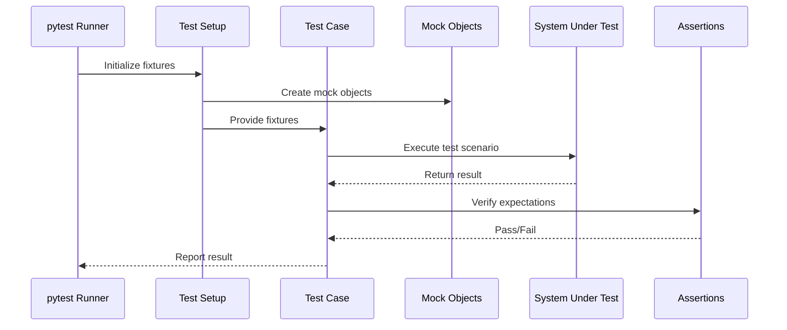

# Design Document: Comprehensive Unit Testing Suite

## Overview

本设计文档描述了为 browser_agent_system_v5 项目创建全面单元测试套件的技术方案。该项目是一个基于多Agent架构的浏览器自动化系统，包含核心模块(core/)、工具包(toolkits/)和权限模块(permissions/)。测试套件将覆盖所有关键模块，确保系统的可靠性和可维护性。

测试策略采用 pytest 框架，使用 pytest-asyncio 处理异步测试，pytest-mock 进行模拟对象管理，pytest-cov 生成覆盖率报告。所有测试文件将放置在项目根目录下的 unit_test/ 文件夹中，与源代码分离以保持项目结构清晰。

## Architecture

```mermaid
graph TD
    A[Test Suite Entry] --> B[Core Module Tests]
    A --> C[Toolkit Module Tests]
    A --> D[Permission Module Tests]
    
    B --> B1[agent_definition_test.py]
    B --> B2[execution_loop_test.py]
    B --> B3[llm_provider_test.py]
    B --> B4[skill_registry_test.py]
    B --> B5[hook_registry_test.py]
    B --> B6[context_compactor_test.py]
    B --> B7[worktree_test.py]
    B --> B8[session_persistence_test.py]
    B --> B9[prompt_builder_test.py]
    B --> B10[resource_manager_test.py]
    B --> B11[agent_spawner_test.py]
    B --> B12[teammate_context_test.py]
    
    C --> C1[tool_registry_test.py]
    C --> C2[base_tool_test.py]
    C --> C3[browser_tools_test.py]
    C --> C4[file_tools_test.py]
    C --> C5[code_tools_test.py]
    C --> C6[lead_tools_test.py]
    C --> C7[vision_helper_test.py]
    
    D --> D1[input_sanitizer_test.py]
    D --> D2[denial_tracker_test.py]
```



## Sequence Diagrams

### Test Execution Flow



## Components and Interfaces

### Test Configuration Module

**Purpose**: 提供测试配置、fixtures和工具函数

**Interface**:
```python
# unit_test/conftest.py
import pytest
from typing import Dict, Any

@pytest.fixture
def mock_llm_provider():
    """Mock LLM provider for testing"""
    pass

@pytest.fixture
def temp_worktree(tmp_path):
    """Temporary worktree for file operations"""
    pass

@pytest.fixture
def sample_context():
    """Sample TeammateContext for testing"""
    pass
```

**Responsibilities**:
- 提供共享的 pytest fixtures
- 配置测试环境
- 提供测试数据生成器

### Core Module Test Suite

**Purpose**: 测试核心模块的功能

**Test Files**:
- `test_agent_definition.py`: Agent人格定义测试
- `test_execution_loop.py`: 执行循环测试
- `test_llm_provider.py`: LLM提供方测试
- `test_skill_registry.py`: 技能注册表测试
- `test_hook_registry.py`: Hook注册表测试
- `test_context_compactor.py`: 上下文压缩测试
- `test_worktree.py`: 工作区管理测试
- `test_session_persistence.py`: 会话持久化测试

### Toolkit Module Test Suite

**Purpose**: 测试工具包模块的功能

**Test Files**:
- `test_tool_registry.py`: 工具注册表测试
- `test_base_tool.py`: 工具基类测试
- `test_browser_tools.py`: 浏览器工具测试
- `test_file_tools.py`: 文件工具测试
- `test_code_tools.py`: 代码工具测试

### Permission Module Test Suite

**Purpose**: 测试权限和安全模块

**Test Files**:
- `test_input_sanitizer.py`: 输入安全校验测试
- `test_denial_tracker.py`: 熔断器测试

## Data Models

### Test Case Model

```python
from dataclasses import dataclass
from typing import Any, Callable, Optional

@dataclass
class TestCase:
    """测试用例数据模型"""
    name: str
    description: str
    setup: Optional[Callable] = None
    teardown: Optional[Callable] = None
    expected_result: Any = None
    should_raise: Optional[type] = None
```

### Mock Configuration Model

```python
@dataclass
class MockConfig:
    """Mock对象配置模型"""
    target: str
    return_value: Any = None
    side_effect: Optional[Callable] = None
    spec: Optional[type] = None
```

## Algorithmic Pseudocode

### Main Test Discovery Algorithm

```pascal
ALGORITHM discoverAndRunTests()
INPUT: test_directory (path to unit_test folder)
OUTPUT: test_results (TestReport)

BEGIN
  ASSERT test_directory exists AND is_directory
  
  // Step 1: Discover all test files
  test_files ← []
  FOR each file IN test_directory DO
    IF file.name MATCHES "test_*.py" OR file.name MATCHES "*_test.py" THEN
      test_files.add(file)
    END IF
  END FOR
  
  ASSERT test_files.length > 0
  
  // Step 2: Collect test cases from each file
  test_cases ← []
  FOR each test_file IN test_files DO
    module ← import_module(test_file)
    FOR each function IN module DO
      IF function.name STARTS_WITH "test_" THEN
        test_cases.add(TestCase(
          name=function.name,
          module=test_file,
          function=function
        ))
      END IF
    END FOR
  END FOR
  
  // Step 3: Execute test cases
  results ← TestReport()
  FOR each test_case IN test_cases DO
    result ← execute_test(test_case)
    results.add(result)
  END FOR
  
  ASSERT results.total_count = test_cases.length
  
  RETURN results
END
```

**Preconditions:**
- test_directory exists and is accessible
- pytest is installed and configured
- All test files follow naming conventions

**Postconditions:**
- All test files are discovered
- All test cases are executed
- Test report is generated with pass/fail status

**Loop Invariants:**
- All processed test files are valid Python modules
- Test case count matches discovered test functions

### Test Execution Algorithm

```pascal
ALGORITHM executeTest(test_case)
INPUT: test_case (TestCase object)
OUTPUT: test_result (TestResult object)

BEGIN
  result ← TestResult(name=test_case.name)
  
  TRY
    // Setup phase
    IF test_case.setup IS NOT NULL THEN
      test_case.setup()
    END IF
    
    // Execution phase
    start_time ← current_time()
    test_case.function()
    end_time ← current_time()
    
    result.status ← "PASSED"
    result.duration ← end_time - start_time
    
  CATCH AssertionError AS e
    result.status ← "FAILED"
    result.error ← e.message
    result.traceback ← e.traceback
    
  CATCH Exception AS e
    result.status ← "ERROR"
    result.error ← e.message
    result.traceback ← e.traceback
    
  FINALLY
    // Teardown phase
    IF test_case.teardown IS NOT NULL THEN
      test_case.teardown()
    END IF
  END TRY
  
  RETURN result
END
```

**Preconditions:**
- test_case is a valid TestCase object
- test_case.function is callable
- Required fixtures are available

**Postconditions:**
- Test result status is one of: PASSED, FAILED, ERROR
- Execution duration is recorded
- Setup and teardown are executed regardless of test outcome

## Key Functions with Formal Specifications

### Function 1: create_mock_llm_provider()

```python
def create_mock_llm_provider(
    response_text: str = "Mock response",
    tool_calls: list = None,
    stop_reason: str = "end_turn"
) -> Mock:
    """Create a mock LLM provider for testing"""
    pass
```

**Preconditions:**
- response_text is a non-empty string
- tool_calls is None or a list of valid tool call dictionaries
- stop_reason is a valid stop reason string

**Postconditions:**
- Returns a Mock object with generate_response method
- generate_response returns (response_text, tool_calls, stop_reason)
- Mock can be used in place of real LLM provider

**Loop Invariants:** N/A

### Function 2: create_temp_worktree()

```python
def create_temp_worktree(tmp_path: Path, session_id: str = "test_session") -> Path:
    """Create a temporary worktree for testing"""
    pass
```

**Preconditions:**
- tmp_path is a valid Path object
- tmp_path directory exists and is writable
- session_id is a non-empty string

**Postconditions:**
- Returns a Path object pointing to created worktree
- Worktree directory exists with proper structure
- Worktree is isolated from other tests

**Loop Invariants:** N/A

### Function 3: assert_tool_result()

```python
def assert_tool_result(
    result: str,
    expected_prefix: str = None,
    should_contain: list = None,
    should_not_contain: list = None
) -> None:
    """Assert tool execution result matches expectations"""
    pass
```

**Preconditions:**
- result is a string (tool execution result)
- expected_prefix is None or a non-empty string
- should_contain is None or a list of strings
- should_not_contain is None or a list of strings

**Postconditions:**
- Raises AssertionError if any expectation fails
- No side effects if all assertions pass
- Provides clear error messages on failure

**Loop Invariants:**
- For should_contain: All previously checked strings were found in result
- For should_not_contain: All previously checked strings were not found in result

## Example Usage

### Example 1: Testing Agent Definition

```python
import pytest
from core.agent_definition import AgentDefinition, TrustLevel, build_builtin_agents

def test_agent_definition_creation():
    """Test creating an AgentDefinition"""
    agent = AgentDefinition(
        agent_type="test_agent",
        system_prompt="Test prompt",
        trust_level=TrustLevel.WRITE,
        max_turns=10
    )
    
    assert agent.agent_type == "test_agent"
    assert agent.system_prompt == "Test prompt"
    assert agent.trust_level == TrustLevel.WRITE
    assert agent.max_turns == 10
    assert agent.is_read_only == False
    assert agent.can_spawn == False

def test_builtin_agents():
    """Test building builtin agents"""
    agents = build_builtin_agents()
    
    assert "lead" in agents
    assert "browser" in agents
    assert "coding" in agents
    assert "verification" in agents
    
    # Verify lead agent properties
    lead = agents["lead"]
    assert lead.agent_type == "lead"
    assert lead.can_spawn == True
    assert "submit_plan" in lead.allowed_tools
```

### Example 2: Testing Tool Registry

```python
import pytest
from toolkits.tool_registry import ToolRegistry
from toolkits.base_tool import BaseTool
from core.agent_definition import AgentDefinition, TrustLevel

class MockTool(BaseTool):
    name = "mock_tool"
    description = "A mock tool for testing"
    input_schema = {"type": "object", "properties": {}}
    
    async def execute(self, **kwargs):
        return "Mock result"

@pytest.mark.asyncio
async def test_tool_registration():
    """Test tool registration"""
    registry = ToolRegistry()
    tool = MockTool()
    
    registry.register(tool)
    
    assert "mock_tool" in registry.list_tools()
    assert registry.get_tool("mock_tool") == tool

@pytest.mark.asyncio
async def test_tool_filtering():
    """Test tool filtering by agent definition"""
    registry = ToolRegistry()
    tool = MockTool()
    tool.required_trust_level = TrustLevel.WRITE
    registry.register(tool)
    
    # Agent with sufficient trust level
    agent_write = AgentDefinition(
        agent_type="test",
        system_prompt="test",
        trust_level=TrustLevel.WRITE
    )
    filtered = registry.filter_tools(agent_write)
    assert tool in filtered
    
    # Agent with insufficient trust level
    agent_readonly = AgentDefinition(
        agent_type="test",
        system_prompt="test",
        trust_level=TrustLevel.READONLY
    )
    filtered = registry.filter_tools(agent_readonly)
    assert tool not in filtered
```

### Example 3: Testing Input Sanitizer

```python
import pytest
from permissions.input_sanitizer import (
    sanitize_path,
    sanitize_url,
    sanitize_shell_input,
    SanitizationError
)

def test_sanitize_path_valid():
    """Test path sanitization with valid path"""
    worktree = "/tmp/test_worktree"
    path = "data/file.txt"
    
    result = sanitize_path(path, worktree)
    assert result.startswith(worktree)
    assert "data/file.txt" in result

def test_sanitize_path_traversal():
    """Test path sanitization blocks traversal attack"""
    worktree = "/tmp/test_worktree"
    path = "../../../../etc/passwd"
    
    with pytest.raises(SanitizationError) as exc_info:
        sanitize_path(path, worktree)
    
    assert "路径穿越攻击" in str(exc_info.value)

def test_sanitize_url_valid():
    """Test URL sanitization with valid URL"""
    url = "https://example.com"
    result = sanitize_url(url)
    assert result == url

def test_sanitize_url_invalid_protocol():
    """Test URL sanitization blocks invalid protocol"""
    url = "file:///etc/passwd"
    
    with pytest.raises(SanitizationError) as exc_info:
        sanitize_url(url)
    
    assert "禁止的 URL 协议" in str(exc_info.value)
```

## Correctness Properties

### Property 1: Test Isolation
**Universal Quantification**: ∀ test_case₁, test_case₂ ∈ TestSuite: execution(test_case₁) does not affect execution(test_case₂)

**Verification**: Each test uses isolated fixtures and temporary directories

### Property 2: Mock Consistency
**Universal Quantification**: ∀ mock ∈ Mocks: mock.behavior is deterministic and predictable

**Verification**: All mocks return consistent values for same inputs

### Property 3: Coverage Completeness
**Universal Quantification**: ∀ module ∈ {core, toolkits, permissions}: ∃ test_file ∈ TestSuite: test_file covers module

**Verification**: Every source module has corresponding test file

### Property 4: Async Safety
**Universal Quantification**: ∀ async_test ∈ AsyncTests: async_test properly awaits all coroutines

**Verification**: All async tests use @pytest.mark.asyncio decorator

### Property 5: Error Handling
**Universal Quantification**: ∀ test ∈ TestSuite: test handles expected exceptions with pytest.raises()

**Verification**: All exception tests use proper assertion context managers

## Error Handling

### Error Scenario 1: Import Errors

**Condition**: Test file cannot import source module
**Response**: pytest reports import error with traceback
**Recovery**: Fix import path or module structure

### Error Scenario 2: Fixture Failures

**Condition**: Fixture setup fails
**Response**: Skip dependent tests with clear error message
**Recovery**: Fix fixture implementation or dependencies

### Error Scenario 3: Async Test Timeout

**Condition**: Async test takes too long to complete
**Response**: pytest-asyncio timeout with error
**Recovery**: Optimize test or increase timeout limit

### Error Scenario 4: Mock Configuration Error

**Condition**: Mock object not properly configured
**Response**: Test fails with AttributeError or TypeError
**Recovery**: Fix mock configuration in conftest.py

## Testing Strategy

### Unit Testing Approach

**Scope**: Test individual functions and classes in isolation

**Key Test Cases**:
1. **Agent Definition Tests**
   - Test AgentDefinition creation with various parameters
   - Test trust level validation
   - Test builtin agents configuration

2. **Tool Registry Tests**
   - Test tool registration and retrieval
   - Test tool filtering by agent definition
   - Test schema generation

3. **LLM Provider Tests**
   - Test Anthropic provider initialization
   - Test OpenAI provider initialization
   - Test response generation (mocked)
   - Test error handling

4. **Skill Registry Tests**
   - Test skill file parsing
   - Test skill selection by URL
   - Test skill selection by keywords

5. **Hook Registry Tests**
   - Test hook registration
   - Test hook emission
   - Test hook action handling (ALLOW/BLOCK/MODIFY)

6. **Context Compactor Tests**
   - Test token ratio calculation
   - Test compression trigger
   - Test message preservation

7. **WorkTree Tests**
   - Test worktree creation
   - Test path resolution
   - Test path traversal prevention

8. **Session Persistence Tests**
   - Test session save
   - Test session load
   - Test session listing

9. **Input Sanitizer Tests**
   - Test path sanitization
   - Test URL sanitization
   - Test shell input sanitization
   - Test payment action sanitization

10. **Denial Tracker Tests**
    - Test denial recording
    - Test circuit breaker trigger
    - Test cooldown period

**Coverage Goals**:
- Line coverage: > 80%
- Branch coverage: > 70%
- Function coverage: > 90%

### Property-Based Testing Approach

**Property Test Library**: hypothesis

**Key Properties to Test**:
1. **Path Sanitization Property**: Any path input should either be sanitized to worktree or raise SanitizationError
2. **Token Estimation Property**: Estimated tokens should be proportional to message length
3. **Hook Execution Property**: Hook handlers should be called in registration order

### Integration Testing Approach

**Note**: Integration tests are out of scope for this unit test suite. They should be created separately to test:
- End-to-end agent execution
- Tool integration with real browsers
- LLM provider integration with real APIs

## Performance Considerations

**Test Execution Speed**:
- Target: All unit tests complete in < 30 seconds
- Use mocks to avoid slow I/O operations
- Use pytest-xdist for parallel execution

**Resource Usage**:
- Temporary files cleaned up after each test
- Mock objects released after test completion
- No persistent state between tests

## Security Considerations

**Test Data Security**:
- No real API keys in test code
- Use environment variables for sensitive data
- Mock all external API calls

**Isolation**:
- Tests run in isolated temporary directories
- No access to production data
- No network calls to external services

## Dependencies

**Testing Framework**:
- pytest >= 7.0.0
- pytest-asyncio >= 0.21.0
- pytest-mock >= 3.10.0
- pytest-cov >= 4.0.0

**Optional**:
- pytest-xdist (for parallel execution)
- hypothesis (for property-based testing)

**Project Dependencies**:
- All dependencies from browser_agent_system_v5/requirements.txt
