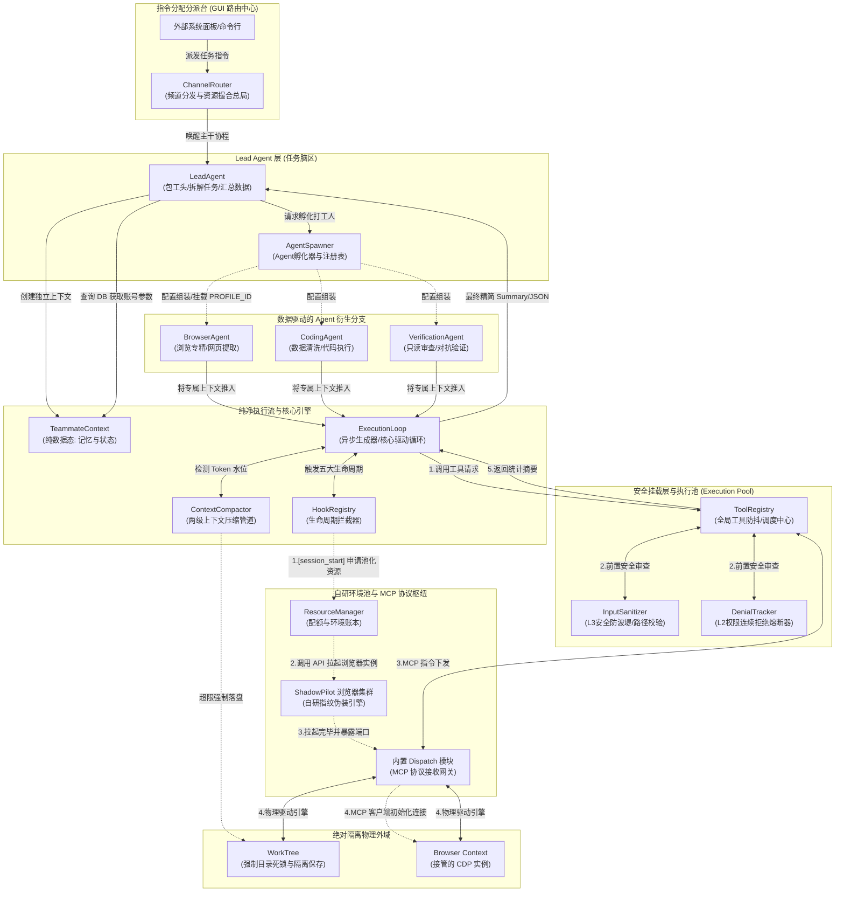
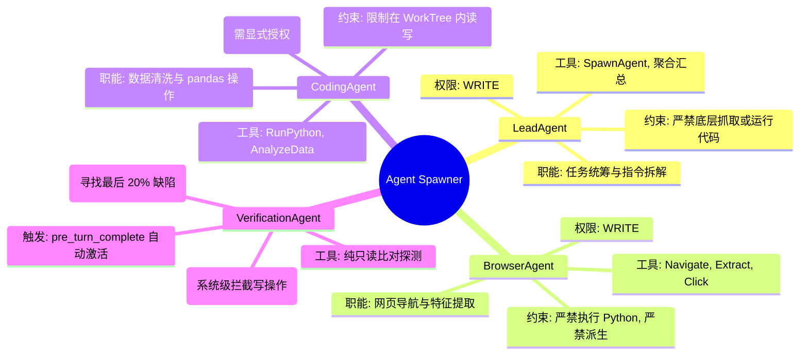
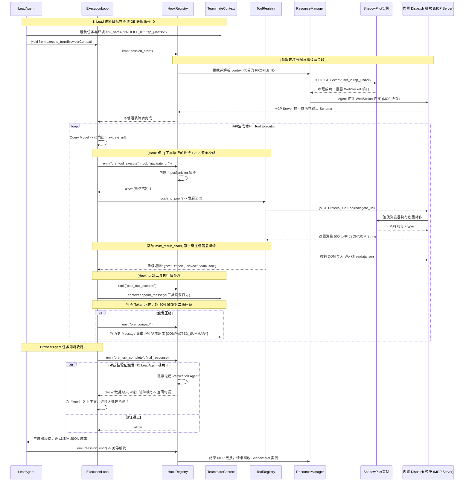

# 浏览器特工系统 V4 架构设计白皮书 (Browser Agent System V4)

基于“端到端任务闭环”的真实业务需求，结合 Claude Code 架构特性的深度剖析，V4 版本在原有“全能跨域操作引擎”的基础上，确立了**高并发、解耦、动态调度以及极致安全**的大统一核心架构原则。

---

## 一、 系统核心设计理念

> [!IMPORTANT]
> **“频道解耦路由 + 数据驱动 Agent 注册表 + 4层安全防御 + 运行时活体热换脑 + WorkTree 严格物理隔离”**

1. **Agent 不是类，而是数据**：彻底抛弃庞大的 `AsyncTeammate` 上帝对象。执行引擎（`execution_loop.py`）是一个通用的纯函数生成器。所有 Agent（Lead, Browser, Coding, Verification）的差异化完全由 `AgentDefinition` 配置（工具白名单、Trust Level、System Prompt）驱动。
2. **执行指令与状态数据的强制解耦**：状态数据被收敛在纯净的 `TeammateContext` 中。支持在不丢失 Session 记忆的前提下，底层无感取消协程并热切换大模型底座（Hot Model Swap）。
3. **四层沙箱安全防御与上下文压缩**：面对不可控的互联网环境，建立 L1-L4 的严格权限拦截闭环（Prompt 隔离 → 权限熔断 → 工具参数校验 → 浏览器隔离）。针对海量 DOM 日志，提供两级上下文压缩管道（即时截断落盘 + 80% 阈值 LLM 摘要），防止 Token 爆炸。
4. **生命周期 Hook 拦截器**：内建 5 大核心生命周期 Hook（Session 启动、工具前置、工具后置、压缩前置、Turn结束），为实现“对抗性验证 (Verification)”以及数据清洗提供回调注胶孔。

---

## 二、 全局统筹组件宏观流向图



---

## 三、 四大内建特工拓扑 (4-Agent Topology)

系统不再是简单的二元模型，而是构建了严密的流水线分工体系。



---

## 四、 端到端核心业务流时序图 (含 Hook 钩子与压缩)

此流程演示了 LeadAgent 如何调度 BrowserAgent 抓取网页，以及底层的拦截机制。



---

---

## 五、 自研浏览器 ShadowPilot 与 MCP 协议接管方案

在应对真实世界的电商、社交媒体等风控场景时，不可使用本地原生的浏览器进程。V4 架构摒弃了传统的底层 CDP 直接相连模式，转而利用**自研跑分指纹浏览器 ShadowPilot** 配合 Model Context Protocol (MCP) 规范实现解耦和高度安全接管：

### 1. 本地存储物理映射隔离
账号环境不写在代码中，Agent 的大脑只认识业务标签，资源层才认识物理 ID。
系统在本地维护一张 DB 字典映射表：任务诉求（如：“我要用美国站一号亚马逊账号”） ➔ Backend 静态 ID（如：`profile_id: "sp_j9sd2kx"`）。 

### 2. Context 携带意图与 Hooks 拦截
Lead Agent 在组装出 Browser Agent 时，不再让 Agent 去自动冷启动 Chrome。而是通过配置 `env_vars={"PROFILE_ID": "sp_j9sd2kx"}` 写死在 `TeammateContext` 中。
引擎 `ExecutionLoop` 启动那一刻就会触发 `session_start` 钩子。由内置的资源管控 Handler 拦截到该意图，转交给内部的 `ResourceManager`。

### 3. ShadowPilot 拉起与 MCP 协议栈无缝交接
`ResourceManager` 通过 HTTP Local API 唤醒 ShadowPilot。浏览器引擎在底层自动部署专属静态代理 IP，并挂载指定屏幕/字体/显卡等硬件指纹。
启动成功后，ShadowPilot 内部自带的 **Dispatch 模块** 将暴露一个 WebSocket 端口兼作 MCP Server。`BrowserAgent` 便以 MCP Client 的身份，通过该端口（`ws_endpoint`）接入。后续由大模型制定的所有 Web 操作意图（`navigate`、`click`）均以标准的 MCP `CallTool` 请求越过边界，由浏览器那头的 Dispatch 模块本地解析执行并返回安全序列化好的 DOM JSON/文本。在生命周期结束（`session_end`）后断开重连握手，并通知后台回收浏览器进程。

---

## 六、 V4 推荐微服务模块规范区划

针对高内聚、低耦合架构，重构后的核心文件区划如下：

```text
browser_agent_system_v3/
├── core/                       # (司令塔台 - 严控流程生命与上下文循环)
│   ├── execution_loop.py       # 【核心驱动】纯函数生成器大循环，不带状态的纯净发动机
│   ├── teammate_context.py     # 【记忆载体】会话短记忆与长偏好数据体（解耦状态）
│   ├── agent_definition.py     # 【配置模板】声明各 Agent 身份档（白名单/系统提示词/权限）
│   ├── agent_spawner.py        # 【孵化路由】统一维护 Agent 注册表并组装 Context
│   ├── prompt_builder.py       # 【指令工厂】Cache静态装配与动态边界划分，防御提示词注入
│   ├── context_compactor.py    # 【瘦身中间件】两级管道拦截防 Token 爆炸
│   ├── hook_registry.py        # 【生命拦截】5大挂载点事件总线系统
│   └── profiler.py             # 【量化诊断】Checkpoint 性能测速打点
│
├── permissions/                # (防护装甲层 - L2/L3 拦截拦截哨)
│   ├── input_sanitizer.py      # L3 防穿越与注入（挂载于 pre_tool_execute）
│   └── denial_tracker.py       # L2 断路器，权限连续失败自动熔断
│
├── toolkits/                   # (战术武器库 - 受限制的物理手臂)
│   ├── base_tool.py            # 工具契约声明（强制标明破坏性与 max_result_chars 限制）
│   ├── tool_registry.py        # 工具池化路由集合与排期防抖机制
│   ├── browser_sandbox_tools.py # 降级输出版的新生网页操控模组
│   └── data_analysis_tools.py  # Pandas 与代码执行区（隔离在 WorkTree 执行的危险品）
│
└── tests/                      # (对抗材质试验场)
    └── v4_verification_suite/  # 完整的落盘截断、沙箱出逃、递归派生等自动化抗压脚本
```
