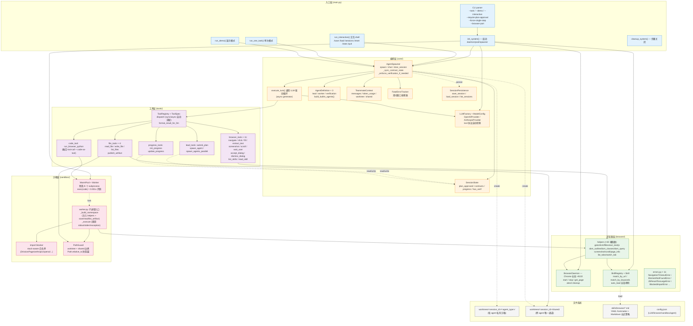
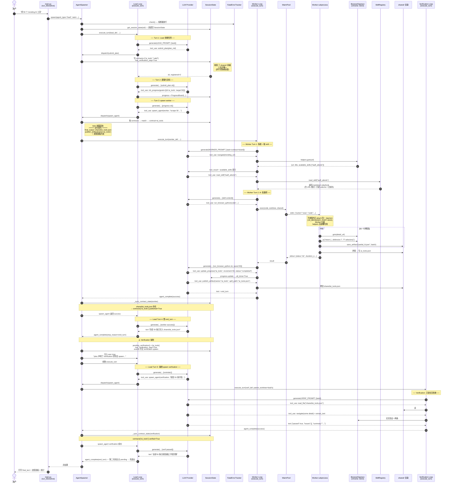

# Browser Agent v6 — 技术架构文档

> 场景对照:本文以 task_1778062783(从 theresanaiforthat.com /trending/ 抓 50 个 AI 工具
> 详情、按 plan 跑 worker + 强制 verification)为 reference task,完整展示 v6 的模块/工具/工厂
> 与时序行为。

---

## 1. 功能架构图(分层视角)



---

## 2. 模块 / 类 / 工厂 / 工具函数清单

### 2.1 入口层 — `main.py`

| 元素 | 类型 | 作用 |
|---|---|---|
| `init_system(config_path, browser_port, ..., require_plan_approval)` | async fn | 4 步初始化:LLM → daemon → pool → spawner;skill auto_load |
| `cleanup_system()` | fn | 关 pool / daemon |
| `run_one_task(task, agent_type, max_turns)` | async fn | 单次任务模式 |
| `run_demo()` | async fn | 内置演示(example.com 抓 title) |
| `run_interactive()` | async fn | 交互 shell;支持 `/save` `/load` `/sessions` `/reset` `/stats` |
| `main()` | async fn | argparse → init → 路由模式 |
| 模块全局 | `DAEMON / POOL / SPAWNER / ACTIVE_LEAD_CONTEXT` | 进程内单例 |

### 2.2 编排层 — `core/`

#### `agent_spawner.py`
```
class AgentSpawner
  ├─ __init__(registry, llm, worktrees_root, shared_dir_root, pool, fatal_tracker, require_plan_approval)
  ├─ register_builtin(force_single_step_browser)
  ├─ register(agent_def)
  ├─ get_def(agent_type) / list_agents()
  ├─ get_session_state(session_id) → SessionState     # 取或建
  ├─ clear_session(session_id)                         # /reset 调
  ├─ async spawn(agent_type, task, session_id, env_vars, max_turns, parent_worktree)
  │     ├─ fatal_tracker.check (熔断)
  │     ├─ worktree + shared_dir 准备
  │     ├─ task 过长 → 落盘 input_payload.md
  │     ├─ progress_board.format_for_prompt() 自动追加(若 worker)
  │     ├─ execute_turn(...) async for events
  │     ├─ fatal → fatal_tracker.record
  │     ├─ success → _sync_contract_state
  │     └─ lead end_turn → _enforce_verification_if_needed
  ├─ async chat(context, message)                      # 多轮接续
  ├─ _sync_contract_state(st, agent_type)              # shared/<name> 存在 → published; verif 完成 → verified
  └─ async _enforce_verification_if_needed(context, agent_def, events)
        # plan 含 verification 但未跑 → 注入 reminder + 续 1 轮

helper:
  _summarize_input(d, maxlen)
  _has_verification_in_input(input_dict)
```

#### `agent_definition.py`
```
@dataclass AgentDefinition
  agent_type / system_prompt / allowed_tools / max_turns
  can_spawn / readonly / uses_browser

build_builtin_agents(force_single_step_browser=False) → Dict[str, AgentDefinition]
  ├─ "lead"         : LEAD_PROMPT, can_spawn,
  │                   tools=[spawn_agent, spawn_agents_parallel, submit_plan,
  │                          init_progress, read_file, list_files], max=30
  ├─ "worker"       : WORKER_PROMPT (+FORCE_SINGLE_STEP_NOTICE 可选),
  │                   tools=[navigate, click, fill, extract_text, screenshot,
  │                          scroll, wait_user, accept_dialog, dismiss_dialog,
  │                          list_skills, read_skill, run_browser_python,
  │                          read_file, write_file, list_files, publish_artifact,
  │                          update_progress], max=50, uses_browser
  └─ "verification" : VERIFICATION_PROMPT, readonly, uses_browser,
                      tools=[read_file, list_files, navigate, screenshot,
                             scroll, extract_text], max=25
```

#### `execution_loop.py`
```
async def execute_turn(context, agent_def, llm, registry, tool_ctx, browser_lock)
                  → AsyncGenerator[event dict]
  事件类型: turn_start / llm_text / tool_use / tool_result / turn_end /
           llm_error / warn / agent_complete

  helpers:
    _build_initial_user_msg(context)
    _call_llm(llm, system_prompt, messages, tool_schemas)
    _is_browser_tool(name) — 决定是否要 acquire browser_lock

  常量: SOFT_TOKEN_HINT_RATIO = 0.85
```

#### `session_state.py` (本次新增的核心容器)
```
@dataclass Goal       — id / description / target / current / status / notes
                        update(increment, status, note) / is_done()
@dataclass ProgressBoard — goals: Dict[str, Goal]
                        add_goal / update / all_done / summary / format_for_prompt
@dataclass Contract   — name / output_path / schema / agent_type / description
                        published: bool / verified: bool
@dataclass SessionState
  session_id / plan_approved / plan_md
  contracts: Dict[str, Contract] / has_verification_step
  progress: Optional[ProgressBoard]
  add_contract / mark_published / mark_verified
  pending_verification() / status()
```

#### `context.py`
```
@dataclass TeammateContext
  agent_type / session_id / task / worktree_path / shared_dir
  messages / token_usage / max_tokens / env_vars
  append_message(role, content)  → 同时累加 token (tiktoken 估算)
  get_token_ratio()
```

#### `fatal_tracker.py`
```
@dataclass FatalErrorTracker
  max_fatal=3, cool_down_seconds=300
  errors: List[(ts, reason)]
  record(reason) / check() → (ok, msg) / reset() / status()
```

#### `llm_provider.py`
```
@dataclass ModelConfig
  provider / model_id / api_key / base_url / max_tokens / temperature
  load_from_file(path) — 读 config.json

class BaseLLMProvider (ABC)
  abstract async generate_response(system_prompt, messages, tools)
                        → (text, tool_uses, stop_reason)

class AnthropicProvider(BaseLLMProvider)
class OpenAIProvider(BaseLLMProvider)
  - 自动把 Anthropic tool schema 转 OpenAI function calling
  - 自动把 OpenAI tool_calls 反向转回 Anthropic tool_use blocks

class LLMFactory
  @staticmethod create_provider(config) → BaseLLMProvider
```

#### `session_persistence.py`
```
SessionPersistenceError
save_session(context, path) → meta dict
load_session(path) → (TeammateContext, meta)
list_sessions(dir) → [meta...]
```

### 2.3 工具层 — `tools/`

#### `base.py`
```
@dataclass ToolSpec
  name / description / input_schema / handler
  readonly / long_running
  to_anthropic_schema() / to_openai_schema()

@dataclass ToolContext
  worktree / shared_dir / session_id / agent_type
  pool / spawner / extra

class ToolRegistry
  register / register_many / get / names / filter_by_names / all

async dispatch(registry, name, tool_input, ctx)
  → {status:'ok', result} | {status:'error', exception, message, traceback}
  自动适配:async handler 直接 await;sync handler 走 asyncio.to_thread

format_result_for_llm(result, max_inline_chars=2000)
  — 大结果截断 + 错误格式化(只留 traceback 末 5 行)

build_default_registry() (in tools/__init__.py)
```

#### 各工具(ToolSpec 实例)

| 文件 | 工具(name) | handler | 备注 |
|---|---|---|---|
| `lead_tools.py` | `submit_plan` | sync | 解析 plan + **唯一 contract 名校验** + **可选审批门** |
| | `spawn_agent` | **async** | 注入交付契约 + 审批门检查 |
| | `spawn_agents_parallel` | **async** | 并发(浏览器仍由 lock 串行) |
| | helpers: `parse_plan / find_contract_for_task / format_contract_block / _basename_no_ext / _check_approval_gate / _ask_user_approval` | | |
| `progress_tools.py` | `init_progress` | sync | Lead 建量化目标(只对量化任务) |
| | `update_progress` | sync | Worker 上报 batch 进度 |
| `browser_tools.py` | `navigate` | sync | 返回 `available_skills` 自动追加(本次新增) |
| | `click / fill / extract_text / screenshot / scroll` | sync | |
| | `wait_user / accept_dialog / dismiss_dialog` | sync | wait_user 强同步阻塞(已修) |
| | `list_skills / read_skill` | sync | 按需读取 skill 内容 |
| `code_tool.py` | `run_browser_python` | async | → POOL.exec(code) — 融合 code-as-tool |
| `file_tools.py` | `read_file / write_file / list_files / publish_artifact` | sync | `_normalize_path` 把 'shared/x' 重映射;publish 写 `shared/<name>` |

### 2.4 浏览器层 — `browser/`

```
class BrowserDaemon                            # daemon.py
  start() / stop() / get_page() / is_alive
  自动发现 Chrome 二进制 / atexit cleanup
  attach 模式: ChromiumOptions().set_address(f"127.0.0.1:{port}")

helpers (helpers.py 全部裸函数,worker subprocess 也直用):
  ─ 导航     goto / current_url / current_title / page_info / wait_for_element
  ─ 交互     click / fill / extract_text / screenshot / scroll
  ─ JS       js / run_js_extract / run_js_batch
  ─ DOM 探查 dom_outline / dom_classes / dom_query
  ─ Tab      list_tabs / switch_tab / new_tab / close_tab
  ─ 弹窗     accept_dialog / dismiss_dialog
  ─ Skills   list_skills / read_skill (附在 navigate 返回里自动 hint)
  ─ 全局     set_active_port / _get_page (V6_BROWSER_PORT 环境变量)

class Skill / class SkillRegistry              # skills.py
  Skill: name / triggers (url_patterns + keywords) / content / size_tokens
  SkillRegistry.load_all() / match_by_url / match_by_keywords / match
  全局: _REGISTRY / set_registry / get_registry / auto_load()

errors.py:                                     # 11 个自定义异常类
  DaemonNotReadyError / NavigationTimeoutError / ElementNotFoundError /
  JSExecutionError / JSResultTooLargeError / PendingDialogError /
  HumanInterventionRequired / BlockedImportError /
  PathEscapeError / SkillLoadError / SandboxStartupError
```

### 2.5 沙箱层 — `sandbox/`

```
class WarmPool                                  # pool.py
  size / blocked_imports / env_passthrough / browser_port
  start() / shutdown() / async exec(code, worktree, shared) → result
  内部维护一个 idle queue,exec 时 pop 一个 worker,执行完归还
  stats(): {alive, idle, busy, total_execs}

class Worker                                    # pool.py
  proc / pid / status (idle/busy/dead)
  inject V6_BROWSER_PORT env var → helpers 自动 attach 同一 daemon

worker.py (subprocess entry)                   # 协议: JSON line over stdin/stdout
  main() - 1) install_blocker  2) sys.path += project_root
            3) auto_load skills 4) loop _recv → _execute → _send
  _build_namespace(worktree, shared) - 注入:
       std libs / pandas / numpy / browser.helpers 全裸函数 / errors 全异常类
       PathGuard / save_artifact / read_artifact / list_artifacts
  _execute(code, ns) - 在隔离 namespace exec,捕获 stdout/stderr/异常

blocker.py — sys.meta_path stack-aware import blocker
  install(blocked_imports)
  _is_trusted_caller(stack) — DrissionPage / anthropic / openai / pandas 白名单

class PathGuard / PathEscapeError              # path_guard.py
  resolve(path, mode='read'|'write') - Path.relative_to 防穿越
  worktree(读写) + shared_dirs(读写)
```

### 2.6 文件 / 数据约定

```
worktrees/
  <session_id>/
    lead/         (lead 私有 — 通常很少落盘)
    worker/       (worker 私有 spill: spill_*.txt / extract_part*.txt)
    verification/ (verif 复用父 worktree,只读)
    shared/       (跨 agent 唯一通道,publish_artifact 落点)
      products.json
      validation.txt
      ...
skills/browser/<host>.md  (YAML frontmatter + Markdown)
config.json (llm/browser/sandbox/agent 四节)
```

---

## 3. 任务时序图 — 以 task_1778062783 为例

> 任务:从 https://theresanaiforthat.com/trending/ 抓 50 个 AI 工具的详情页数据,
> 输出 `shared/ai_tools.json`,并在 plan 中声明 verification。



---

## 4. 数据流架构图(以 contract / progress / skill 三条主线为例)

```mermaid
flowchart LR
    subgraph PlanFlow["契约流(Contract Flow)"]
        A1[Lead.LLM 生成 plan_md]
        A2[submit_plan 解析 + 唯一名校验]
        A3[SessionState.contracts]
        A4[spawn 时 find_contract_for_task<br/>→ format_contract_block<br/>→ 追加到 task 末尾]
        A5[Worker.LLM 看到 ━━ 交付契约 ━━]
        A6[Worker publish_artifact]
        A7[shared/&lt;name&gt;.json]
        A8[_sync_contract_state<br/>contract.published=True]
        A9[Verification 完成<br/>contract.verified=True]
        A1-->A2-->A3-->A4-->A5-->A6-->A7-->A8-->A9
    end

    subgraph ProgressFlow["进度流(Progress Flow)"]
        B1[Lead.LLM 调 init_progress]
        B2[ProgressBoard 建 Goal]
        B3[spawn worker 时<br/>format_for_prompt 追加]
        B4[Worker.LLM 看到面板]
        B5[Worker 每批<br/>update_progress + increment]
        B6[Goal.update → status auto]
        B7[下次 spawn 看到最新 current/target]
        B1-->B2-->B3-->B4-->B5-->B6-->B7
        B7-->B3
    end

    subgraph SkillFlow["Skill 流(Skill Flow)"]
        C1[启动: skills.auto_load]
        C2[SkillRegistry 全局单例]
        C3[Worker navigate&#40;url&#41;]
        C4[helpers.goto 内部<br/>match_by_url]
        C5[response 含<br/>available_skills 列表]
        C6[Worker.LLM 看到提示]
        C7[read_skill&#40;name&#41;]
        C8[返回 playbook 内容<br/>(URL 模式/选择器/已知坑)]
        C1-->C2
        C3-->C4-->C5-->C6-->C7-->C2
        C8-->C7
    end
```

---

## 5. 安全/护栏栈(4 + 1 层)

| 层 | 实现 | 防什么 |
|---|---|---|
| **L1 Prompt 隔离** | `agent_definition.py` LEAD/WORKER/VERIF 三套独立 system prompt;子 agent 独立上下文 | Lead 越权干活、verify 改数据 |
| **L2 工具白名单** | `AgentDefinition.allowed_tools` + `ToolRegistry.filter_by_names` | Lead 不能 click,verif 不能 write |
| **L3 沙箱执行** | `sandbox/blocker.py` (import 黑名单 + 白名单调用栈) + `sandbox/path_guard.py` (Path.relative_to) | 业务代码偷接网络 / 路径穿越 |
| **L4 浏览器侧 skill 防注入** | `browser/skills.py` 加载时校验 (size/字符比例) | skill 被恶意改 |
| **L5 LLM 失败熔断**(本次重建) | `core/fatal_tracker.py` + Lead `Task boundary` prompt + verification 强制 | 配额耗尽死循环 / Lead 自我加戏 / 漏 verification |

---

## 6. 与 task_1778062783 中暴露问题的对应修复表

| 旧问题(v5/v6初版) | v6 现在的对应组件 |
|---|---|
| Worker 抓产品官网而不是 taaft 详情页(没人告诉它) | **Skill 自动加载** + navigate 返回 `available_skills` 提示 + `read_skill` 按需取 |
| Lead 自我加戏:多 spawn verification、Excel、报告 | **LEAD_PROMPT.Task boundary** 段 + verification 由系统强制(不是 lead 主动加) |
| LLM 配额耗尽,Lead 仍无限重试 spawn | **FatalErrorTracker** 滑动窗口熔断,3 次/5 分钟 trip;`/reset` 清 |
| Plan 里多 worker 都 publish 同名文件 → 互相覆盖 | **submit_plan 唯一名校验**;workers 各自 publish 到 `shared/<final_name>` |
| 进度无可见性,worker exhaust max_turns 时不知到哪了 | **ProgressBoard**(只对量化任务):面板片段自动注入下次 spawn 的 task |
| Plan 声明了 verification 但 lead 忘 spawn | **_enforce_verification_if_needed**:end_turn 时检测,注入 reminder + 续跑 1 轮 |
| 计划随便改没有人看一眼 | **--require-plan-approval** 终端 y/n 审批门(同 session 已批准不二次审批) |
| 数据离散在 lead_tools 模块全局 dict | **SessionState** 一处统一(plan + contracts + progress + approval),`/save` `/load` 序列化方便 |

---

## 附:关键源文件索引

- 入口:[main.py](../main.py)
- 编排:[core/agent_spawner.py](../core/agent_spawner.py),[core/execution_loop.py](../core/execution_loop.py),[core/agent_definition.py](../core/agent_definition.py),[core/session_state.py](../core/session_state.py),[core/fatal_tracker.py](../core/fatal_tracker.py)
- 工具:[tools/lead_tools.py](../tools/lead_tools.py),[tools/progress_tools.py](../tools/progress_tools.py),[tools/browser_tools.py](../tools/browser_tools.py),[tools/code_tool.py](../tools/code_tool.py),[tools/file_tools.py](../tools/file_tools.py),[tools/base.py](../tools/base.py)
- 浏览器:[browser/daemon.py](../browser/daemon.py),[browser/helpers.py](../browser/helpers.py),[browser/skills.py](../browser/skills.py),[browser/errors.py](../browser/errors.py)
- 沙箱:[sandbox/pool.py](../sandbox/pool.py),[sandbox/worker.py](../sandbox/worker.py),[sandbox/blocker.py](../sandbox/blocker.py),[sandbox/path_guard.py](../sandbox/path_guard.py)
- Skill 库:[skills/browser/taaft_aitools.md](../skills/browser/taaft_aitools.md)
