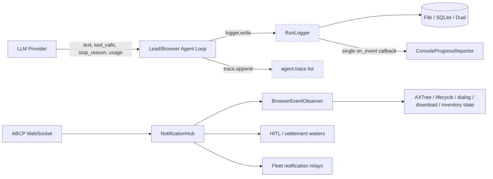
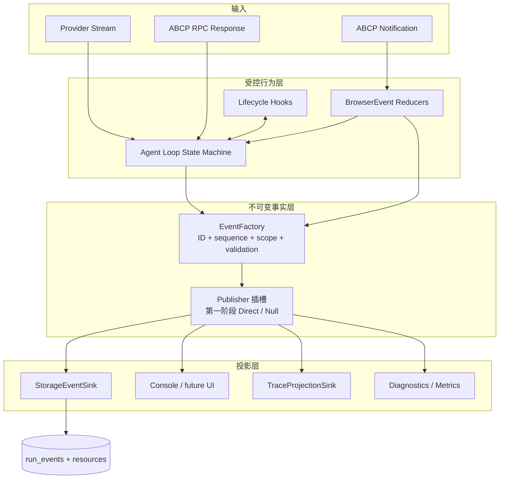
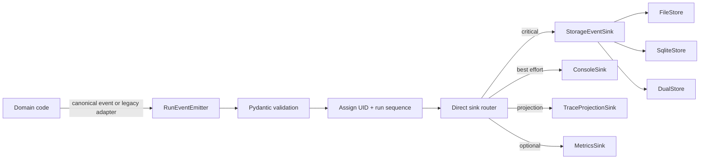
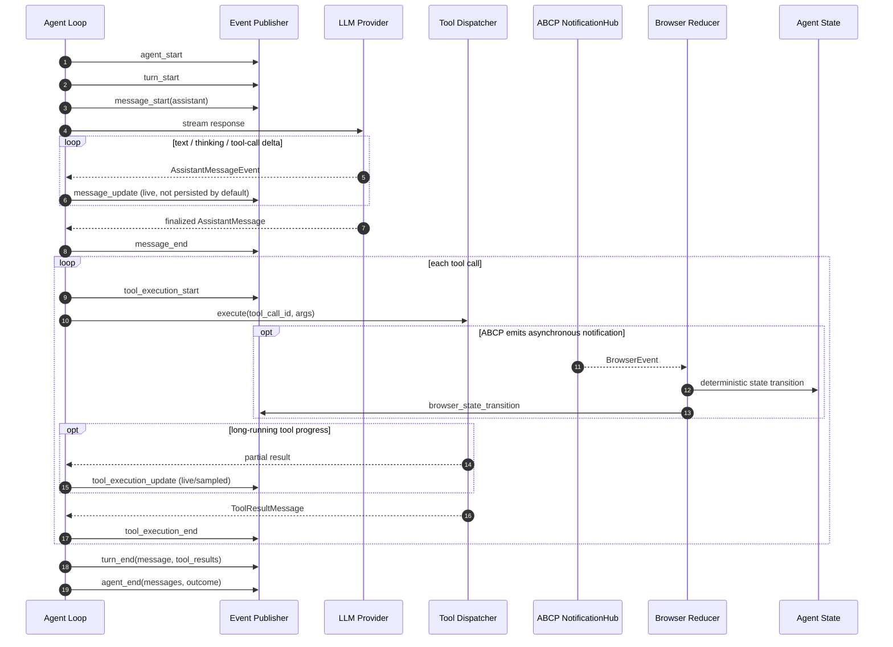
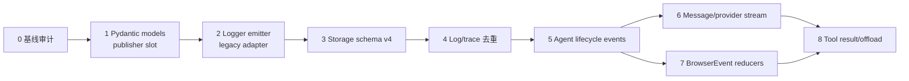

# Agent 事件、消息与日志系统重构实施计划

状态：**部分实施**（2026-09-03，经三轮代码评审并修复；见第 19–22 节）

> **正式 scope cut**：生命周期事件层、存储 envelope、日志管线、assistant 侧 wire helper
> 与 offload 顺序已落地；**canonical transcript 主模型未完成**——`ToolResultMessage`
> 尚未成为两个 agent loop 的运行时消息类型，tool result 仍由循环手工拼 dict，
> `generate_assistant_message()` 仍是未被调用的入口，compaction / resume /
> context snapshot 也仍不基于 canonical transcript。详见第 21.3 节。  
更新时间：2026-09-03  
适用范围：`LeadAgent`、`BrowserAgent`、LLM provider、ABCP notification、`RunLogger`、`agent.trace`、`harness.storage`

> 本文第 1–18 节保留为**原始计划**，未按实施结果回改，以便对照。
> 实际做了什么、哪些地方偏离了计划、为什么偏离，全部集中在第 19 节。

---

## 1. 结论

本次重构不以“一次性复制 Pi Agent 的完整事件系统”为目标，而采用以下优先级：

1. **先重构日志系统**：建立统一、可验证、可检索的事件 envelope 和 sink 管线，消除 `logger.write()`、`agent.trace.append()`、Console callback 三套并行事实源。
2. **预留 AgentEventBus 插槽**：先定义 typed publisher 协议和 10 类生命周期事件，不立即建设 replay、背压、跨进程订阅等完整总线能力。
3. **允许增加 Pydantic v2 依赖**：消息、生命周期事件、日志 envelope、browser event projection 使用严格判别联合；遗留业务日志通过兼容模型渐进迁移。
4. **行为控制与事件观察严格分离**：`LifecycleHook` / `BrowserEventReducer` 可以改变 agent 状态；普通事件 subscriber 只能观察事实，不能隐式改写执行结果。
5. **ABCP 原始事件默认不进入 LLM 上下文**：只有经过明确选择、去敏、合并和因果降级后的 `BrowserObservationMessage` 才能进入模型视图。
6. **tool result 保持 RPC 配对真实性**：实际 RPC 返回、harness annotation、异步 browser event 分层记录，不再混成无法辨别来源的单一对象。

建议按第 12 节的 8 个阶段实施。阶段 1–4 是近期主线（Pydantic + 日志重构）；阶段 5 以后才逐步启用完整生命周期、provider stream、BrowserEvent reducer 和 offload 调整。

---

## 2. 目标与非目标

### 2.1 目标

- 每个持久化事件都有稳定 schema、唯一 ID、单调序号、时间、actor/worker/phase/turn/message/tool scope。
- 同一业务事实只生产一次，由 sink 投影到 SQLite、JSONL、Console、trace 和未来 UI。
- `agent_start/end`、`turn_start/end`、`message_start/update/end`、`tool_execution_start/update/end` 有明确边界。
- thinking、text、tool call 保持有序 content block，不再通过 `usage` 私有字段偷渡。
- BrowserEvent 的“观察”“状态变化”“等待结算”“模型可见投影”四种职责可机械区分。
- 全量 payload 在模型裁剪前持久化；provider 从未生成的 LLM 后缀不得伪称 `full_output`。
- 保持现有 `file` / `dual` / `db` 存储模式、virtual FS、resume、测试和 Console 输出兼容。

### 2.2 非目标

- 第一阶段不实现跨进程消息代理、远程事件总线或 Kafka 类基础设施。
- 第一阶段不把所有现有 `logger.write("...", {...})` 事件都建成独立 Pydantic class。
- 不允许普通 subscriber 返回修改后的消息、工具结果或 agent 状态。
- 不把每个 `message_update` token delta 默认写入 SQLite。
- 不用时间邻近或“调用期间出现”推断 ABCP 事件由某个工具调用造成。
- 不在一次提交中同时重写 Lead、Worker、provider、storage、BrowserEvent 和 offload。

---

## 3. 当前系统审计

### 3.1 当前存在的四条通道



问题不在于完全没有事件，而在于：

- `NotificationHub` 是真正广播式 pub/sub，但只服务 ABCP notification。
- `RunLogger.write()` 同时承担持久化和 UI callback，只有一个回调且吞掉异常。
- `agent.trace` 是另一份手工维护的事实副本。
- `LifecycleManager` 是同步 payload-transform middleware，不是生命周期事件流。
- `agent.step.start` / `agent.model` / `agent.final` 是日志命名约定，不能机械证明生命周期成对。
- provider 内部已经流式读取，但只返回聚合四元组，agent 层看不到 message delta。

### 3.2 已存在但尚未形成统一抽象的基础

| 现有组件 | 可复用能力 | 不能直接承担的新职责 |
|---|---|---|
| `abcp_client.NotificationHub` | 广播、waiter、短期 replay、去重、unsubscribe | Agent 生命周期 typed schema、持久化策略、sink 错误等级 |
| `RunLogger` | task/run 绑定、Storage 写入、payload offload | 多 sink、统一 envelope、父子 scope、schema validation |
| `BoundRunLogger` | 注入 worker/slot/agent/phase identity | turn/message/tool scope、不可变事件 context |
| `LifecycleManager` | 确定顺序的 pre/post hook、payload fold | pub/sub、事件持久化、异步 message update |
| `run_events` 表 | 追加、索引、超大 payload 资源化 | 稳定 event UID、run 内 sequence、turn/message/tool 查询 |
| `worker_trace_events` 表 | worker trace 的独立持久化 | 与 run_events 去重、统一事件来源 |

### 3.3 已经改变 agent 行为的 BrowserEvent

| 事件 | 当前 reducer/consumer | 行为影响 | 模型可见策略 |
|---|---|---|---|
| `Page.navigate` / `Page.recovered` / `Page.crashed` | `PageLifecycleTracker`、`BrowserEventObserver` | 更新 lifecycle，invalidate AXTree，后续调用可能被 gate 拒绝 | 通过后续状态/工具回执间接体现 |
| `Page.open` / `Page.close` | `PageInventorySignal`、Fleet runtime | 更新 page inventory generation，要求后续 `Page.list` | 仅投影 change bit，不投影 opener/URL/时序因果 |
| `DOM.axTreeUpdated` | `BrowserEventObserver` | 替换 AXTree、增加 epoch/serial、改变 stale-target 判定 | 默认不进上下文 |
| `Hitl.paused` / `Hitl.resumed` | HITL waiter、Fleet barrier | 认领/释放控制权，暂停或恢复执行 | 通过结构化 HITL receipt 呈现 |
| `Download.*` | download receipt store | 更新下载状态，阻止重复 Download.start | 后续下载回执投影 |
| `Page.dialogOpened/Closed` | dialog ledger | 决定 Page.handleDialog 是否需要 dialogId | 注入后续 Page.getState 的非敏感 identity |
| click/workflow settlement 事件 | Fleet runtime scoped subscriber | 改变导航结果分类与锁释放时机 | 只输出分类 receipt，不声称弱因果为事实 |

---

## 4. 核心架构决策

### D1. AgentEventBus 只预留插槽

近期不实现完整总线。先定义：

```python
class AgentEventPublisher(Protocol):
    def publish(self, event: "AgentEvent") -> None: ...

class NullAgentEventPublisher:
    def publish(self, event: "AgentEvent") -> None:
        return None
```

Agent 构造函数接收 publisher，默认 `NullAgentEventPublisher`。日志重构完成后可接 `DirectEventPublisher`；未来再替换为支持多 subscriber、replay 或异步队列的实现，agent loop 不需要再次改签名。

### D2. 使用 Pydantic v2，但不强迫所有遗留日志一次类型化

在 `requirements.txt` 增加经过项目测试锁定的 Pydantic v2 依赖。核心模型使用：

- `BaseModel`；
- `ConfigDict(extra="forbid", frozen=True)`；
- `Field(discriminator="type")`；
- 缓存的 `TypeAdapter`；
- `model_dump(mode="json", by_alias=True)` 作为唯一序列化入口。

事件分两类：

1. `CanonicalEvent`：Agent 生命周期、消息、工具、BrowserStateTransition，严格字段。
2. `LegacyLogEvent`：保留任意 `event_type + payload`，但 envelope/context 仍必须严格合法。

这样既能建立新地基，又不会要求第一批改动同时迁移数百个诊断事件。

### D3. 行为 hook 与事实 event 分离

```text
LifecycleHook / BrowserEventReducer
    输入：准备执行的操作或外部事件
    权限：可以返回受约束的状态/操作变更
    要求：顺序固定、错误策略明确、可单测

AgentEvent subscriber
    输入：已经发生的不可变事实
    权限：观察、持久化、展示、统计
    禁止：隐式改写 agent 核心状态
```

Pi 的 10 类事件用于表达生命周期；行为变化继续由 `before_tool_call`、`after_tool_call`、`prepare_next_turn`、`should_stop_after_turn`、BrowserEvent reducer 等显式接口承载。

### D4. 一个业务事实只 emit 一次

目标数据流：



`StorageEventSink` 持久化同一个 event；Console、trace、metrics 只是读取并投影，不再要求业务调用点分别写三次。

### D5. 事件 identity 与数据库游标分离

- `event_uid`：应用层 UUID，跨 file/db/dual 后端稳定。
- `sequence_no`：同一 run 内由 emitter 分配的单调序号，用于重放和顺序断言。
- SQLite `event_id`：数据库本地 keyset 游标，不作为跨后端 identity。
- `parent_event_uid`：可选因果/嵌套父节点，只在确有结构关系时填写。
- `observed_during_tool_call_id`：表示时间范围重叠，不能替代 `caused_by_execution_id`。

### D6. 高频 update 与持久化策略分开

| 事件 | 实时发布 | 默认持久化 | 理由 |
|---|---:|---:|---|
| agent/turn start/end | 是 | 是 | 生命周期审计 |
| message start/end | 是 | 是 | transcript 重建 |
| message update | 是 | 否 | token 级高频；message_end 已含最终内容 |
| tool execution start/end | 是 | 是 | 工具审计与配对 |
| tool execution update | 是 | 默认否，可采样 | 长任务进度可能高频 |
| raw BrowserEvent | 内部 hub 是 | 按策略 | 只有控制/诊断价值的事件持久化 |
| BrowserStateTransition | 是 | 是 | 真实改变 agent 行为 |

Debug 模式可开启 delta 持久化，但必须配置上限、采样或 payload offload，不能成为默认。

---

## 5. Pydantic 模型设计

### 5.1 通用 envelope

建议新增 `harness/events/models.py`：

```python
class EventContext(BaseModel):
    model_config = ConfigDict(extra="forbid", frozen=True)

    task_id: str
    run_id: str
    actor_type: Literal["lead", "browser", "system", "browser_platform"]
    agent_id: str | None = None
    worker_id: str | None = None
    slot_id: str | None = None
    phase_id: str | None = None
    turn_id: str | None = None
    message_id: str | None = None
    tool_call_id: str | None = None


class EventEnvelope(BaseModel):
    model_config = ConfigDict(extra="forbid", frozen=True)

    schema_version: Literal[1] = 1
    event_uid: UUID
    sequence_no: int = Field(ge=1)
    emitted_at: datetime
    category: Literal[
        "agent", "turn", "message", "tool", "browser",
        "storage", "diagnostic", "legacy"
    ]
    severity: Literal["debug", "info", "warning", "error"] = "info"
    context: EventContext
    parent_event_uid: UUID | None = None
```

不要把 `task_id/run_id/worker_id` 重新复制到任意 payload。它们属于 envelope/context，并在存储层成为关系字段。

### 5.2 10 类 AgentEvent

事件 payload 对应用户给出的 Pi 结构，但补充 `EventEnvelope`：

```python
class AgentStartEvent(EventEnvelope):
    type: Literal["agent_start"] = "agent_start"

class AgentEndEvent(EventEnvelope):
    type: Literal["agent_end"] = "agent_end"
    messages: list[AgentMessage]
    outcome: AgentOutcome

class TurnStartEvent(EventEnvelope):
    type: Literal["turn_start"] = "turn_start"

class TurnEndEvent(EventEnvelope):
    type: Literal["turn_end"] = "turn_end"
    message: AgentMessage
    tool_results: list[ToolResultMessage]

class MessageStartEvent(EventEnvelope): ...
class MessageUpdateEvent(EventEnvelope): ...
class MessageEndEvent(EventEnvelope): ...
class ToolExecutionStartEvent(EventEnvelope): ...
class ToolExecutionUpdateEvent(EventEnvelope): ...
class ToolExecutionEndEvent(EventEnvelope): ...
```

`AgentEvent` 使用 `Annotated[Union[...], Field(discriminator="type")]`。不要通过继承层级上的虚方法判断事件类型。

### 5.3 日志兼容事件

```python
class LegacyLogEvent(EventEnvelope):
    type: Literal["legacy_log"] = "legacy_log"
    legacy_event_type: str
    payload: dict[str, Any]
```

`RunLogger.write("browser.call.result", payload)` 先通过 adapter 转成该模型。随着调用点迁移，核心事件不再走 `legacy_log`。

### 5.4 BrowserEvent 与状态迁移

```python
class BrowserEvent(BaseModel):
    type: Literal["browser_event"] = "browser_event"
    event_name: str
    event_id: str | None
    cursor: str | None
    payload: dict[str, Any] | PayloadRef
    received_at: datetime
    delivery: BrowserDeliveryProvenance

class BrowserStateTransitionEvent(EventEnvelope):
    type: Literal["browser_state_transition"] = "browser_state_transition"
    reducer: str
    transition: str
    page_id: str | None
    before_digest: str | None
    after_digest: str | None
    source_browser_event_id: str | None
```

状态迁移事件记录 digest 和 routing identity，不把 AXTree、dialog 文本或敏感输入复制进日志。

---

## 6. EventFactory 与 scope 生命周期

建议新增 `harness/events/factory.py`。工厂持有：

- run 级原子 sequence allocator；
- task/run/actor 基础 context；
- 当前 agent/turn/message/tool scope 栈；
- UTC clock 和 UUID factory（测试可注入）；
- Pydantic `TypeAdapter`。

推荐 API：

```python
factory.agent_started(...)
factory.turn_started(...)
factory.message_started(...)
factory.message_updated(...)
factory.message_ended(...)
factory.tool_execution_started(...)
factory.tool_execution_updated(...)
factory.tool_execution_ended(...)
factory.turn_ended(...)
factory.agent_ended(...)
factory.legacy(event_type, payload, severity="info")
```

工厂负责拒绝以下非法构造：

- 没有 active agent 时创建 turn；
- 一个 agent 同时打开两个普通 turn；
- message/tool scope 不属于当前 turn；
- tool end 的 `tool_call_id` 与 start 不同；
- 同一 scope 重复 end；
- `agent_end` 时仍有未关闭 turn/message/tool；
- event context 中 worker/phase 与绑定 context 不一致。

异常和 cancellation 路径通过 scope context manager 保证关闭：

```python
with factory.agent_scope(...) as agent_scope:
    with agent_scope.turn() as turn:
        ...
```

异步 provider/tool 路径使用 `asynccontextmanager`，但事件生成与 storage sink 可以先保持同步，以符合当前 Storage API。

---

## 7. 日志系统重构（近期主线）

### 7.1 目标写入管线



这里的 `Router` 只是同步、多 sink 的直接分发器，是未来 EventBus 的插槽，不包含 replay、队列或复杂订阅管理。

### 7.2 Sink 错误策略

```python
class SinkBinding(BaseModel):
    name: str
    critical: bool
```

- `StorageEventSink`：critical。失败沿用当前行为，上抛并使 run 明确失败，不能静默丢审计事实。
- `ConsoleSink`：best effort。错误不得替换主任务结果。
- `TraceProjectionSink`：初期 best effort，但必须记录一次不可递归的内部 diagnostic。
- sink 失败不能再次通过同一个失败 sink 发布“sink_failed”，防止递归风暴。

### 7.3 RunLogger 兼容策略

保留现有导入路径和调用形式：

```python
logger.write(event_type, payload)
logger.bind_context(...)
logger.record_llm_usage(...)
```

内部改成：

```text
RunLogger.write
  -> EventFactory.legacy
  -> RunEventEmitter.emit
  -> StorageEventSink + ConsoleSink
```

迁移期间严禁形成 `RunLogger -> EventEmitter -> RunLogger` 环。

### 7.4 ConsoleProgressReporter

将 `ConsoleProgressReporter` 从 `Callable[[str, dict], None]` 迁移为 `EventSink`：

- canonical event 直接读取强类型字段；
- legacy event 继续调用原 `_format(event_type, payload)`；
- 输出格式第一阶段保持字节级或语义级兼容；
- worker label 从 `EventContext` 获取，不再猜 payload 是否带 `workerId`。

### 7.5 trace 收敛

当前 `agent.trace.append()` 与 run event 重复。迁移分三步：

1. 建立 trace consumer inventory：哪些校验、worker handoff、replay 工具读取 `self.trace` 或 `worker_trace_events`。
2. `TraceProjectionSink` 从统一事件投影旧 trace shape，业务调用点停止双写。
3. 当所有消费者改读统一事件或稳定 projection 后，移除直接 `trace.append()`；是否删除 `worker_trace_events` 表另立迁移，不在第一批执行。

### 7.6 SQLite schema v4 计划

建议为 `run_events` 增加：

| 字段 | 用途 |
|---|---|
| `event_uid TEXT` | 跨 backend 稳定 identity |
| `schema_version INTEGER` | 事件 schema 演进 |
| `sequence_no INTEGER` | 同 run 总顺序 |
| `category TEXT` | agent/turn/message/tool/browser/legacy 查询 |
| `severity TEXT` | 运维筛选 |
| `agent_id TEXT` / `slot_id TEXT` / `phase_id TEXT` | 关系维度 |
| `turn_id TEXT` / `message_id TEXT` / `tool_call_id TEXT` | 生命周期查询与配对 |
| `parent_event_uid TEXT` | 结构关联，不代替因果证据 |

迁移规则：

- 新列先 nullable，旧行保持诚实的 NULL；
- 新事件必须写全；
- 添加 `UNIQUE(event_uid)` partial index；
- 添加 `(run_id, sequence_no)` partial unique index；
- 添加 `(run_id, turn_id, sequence_no)` 和 `(run_id, tool_call_id, sequence_no)` 查询索引；
- DDL 与 migration version 同事务；
- 更新 FileStore JSONL shape、DualStore semantic hash 和 read normalization；
- virtual FS 继续输出兼容的 `run.jsonl`，旧消费者看见额外字段但不失去既有字段。

Storage 接口新增强类型入口：

```python
append_run_event(event: PersistedRunEvent) -> None
```

原 `append_event(...)` 保留为 legacy adapter，待所有调用点迁移后再评估移除。

---

## 8. Agent 生命周期插槽

### 8.1 标准成功路径



### 8.2 异常路径约束

| 场景 | 必须发出的终止事件 | 禁止行为 |
|---|---|---|
| provider timeout/connection error | 当前 message/turn 以 error/aborted 终止；agent 视重试策略决定是否结束 | 留下 open message scope |
| `max_tokens` | message_end 标记 `stop_reason=length`；保留已收到 blocks | 把未收到后缀称为 full output |
| tool exception | tool_execution_end(`is_error=True`) + ToolResultMessage | start 后直接抛出导致无 end |
| deferred tool call | 生成明确 deferred ToolResultMessage；可选择不发 execution_start | 发 start 但没有 end |
| cancellation | 当前打开 scope 依次关闭为 aborted，最后 agent_end | 只写 `agent.cancelled` legacy log |
| terminal tool | tool_execution_end → turn_end → agent_end | 跳过 turn_end |

### 8.3 工具 update 接口

工具定义逐步增加可选 callback：

```python
ToolUpdateCallback = Callable[[ToolPartialResult], None]
```

第一阶段 dispatcher 支持该参数，但现有工具可不调用。优先接入：

- worker spawn/wait；
- long-running workflow；
- download；
- code agent；
- HITL wait。

Browser notification 本身不是 `tool_execution_update`。只有工具明确消费并产出的 bounded partial receipt 才可成为 tool update。

---

## 9. AgentMessage、provider stream 与 thinking

### 9.1 Canonical AgentMessage

建议新增 `harness/messages/models.py`：

```text
AgentMessage
├── UserMessage
├── AssistantMessage
│   └── ordered content[]
│       ├── TextContent
│       ├── ThinkingContent
│       └── ToolCallContent
├── ToolResultMessage
├── BrowserObservationMessage
├── CompactionSummaryMessage
└── LegacyMessage（仅迁移期）
```

`AssistantMessage` 必须保存原始 content block 顺序。`usage` 只放 usage，不能继续携带 `_assistant_prefix_blocks`。

### 9.2 Provider API

目标接口不是一次返回四元组，而是：

```python
async def stream_response(...) -> AsyncIterator[AssistantMessageEvent]: ...
```

最终事件携带完整 `AssistantMessage`。OpenAI/Anthropic adapter 分别负责 wire conversion，agent loop 只理解 canonical blocks。

迁移期间提供兼容方法：

```python
async def generate_response(...) -> AssistantResponse:
    # 消费 stream_response 并聚合
```

先迁移 provider 测试，再迁移 BrowserAgent，最后迁移 LeadAgent；避免两套 loop 同时失稳。

### 9.3 唯一模型转换边界

```python
to_model_messages(messages: list[AgentMessage], provider: ProviderKind)
```

该函数负责：

- custom/session-only message 过滤；
- BrowserObservationMessage 转 user context；
- thinking round-trip；
- Anthropic/OpenAI tool pairing；
- compaction summary 转换；
- provider-specific wire alias。

任何业务模块不得自己拼 `{"role": "user", "content": ...}` 作为替代转换边界。

---

## 10. BrowserEvent reducer 与模型投影

### 10.1 分类

每种 ABCP event 注册一个 policy：

```python
class BrowserEventPolicy(BaseModel):
    event_name: str
    reducer: str | None
    persistence: Literal["none", "digest", "full_offload"]
    model_visibility: Literal["never", "projected", "receipt_only"]
    sensitivity: Literal["normal", "sensitive", "secret"]
    dedupe_key: Literal["event_id", "cursor", "none"]
```

未知事件默认：

- 不改变 agent 状态；
- 写 bounded diagnostic digest；
- 不进入模型上下文；
- 不参与工具因果归属。

### 10.2 Reducer 接口

```python
class BrowserEventReducer(Protocol):
    def reduce(
        self,
        state: BrowserRuntimeState,
        event: BrowserEvent,
    ) -> BrowserReduction: ...
```

`BrowserReduction` 包含：

- 新状态或明确 state patch；
- `BrowserStateTransitionEvent` 列表；
- 可选 `BrowserObservationCandidate`；
- 可选 waiter signal；
- 不包含任意可执行 tool call。

第一批迁移顺序：

1. dialog ledger（范围小、敏感边界清楚）；
2. page inventory；
3. page lifecycle；
4. download ledger；
5. AXTree update（竞态最复杂）；
6. HITL/Fleet barrier（并发与所有权风险最高）。

### 10.3 因果等级

```text
caused_by_execution_id
    ABCP 明确给出相同 executionId，可建立强关联

correlated_tool_call_id
    harness 有显式协议证据建立关联

observed_during_tool_call_id
    只表示时间重叠，不表示因果

unattributed
    无可靠关联
```

模型投影不得把后两种渲染成“你的点击打开了该页面”。

### 10.4 BrowserObservationMessage

候选观察在 tool batch 结束后统一 coalesce，避免插入 assistant tool call 与 tool result 之间。建议字段：

```python
class BrowserObservationMessage(BaseModel):
    role: Literal["browserObservation"] = "browserObservation"
    observations: list[BrowserObservation]
    source_event_ids: list[str]
    freshness: ObservationFreshness
    context_policy: Literal["include", "exclude", "summary_only"]
    timestamp: datetime
```

`to_model_messages()` 才把 `include` 转成 provider 可接受的 user content；`exclude` 只保留在 transcript/audit。

---

## 11. Tool result 与 offload 调整

### 11.1 ToolExecutionRecord 分层

```python
class ToolExecutionRecord(BaseModel):
    tool_call: ToolCall
    transport: TransportReceipt | None
    raw_result: PayloadRef | InlinePayload
    normalized_result: PayloadRef | InlinePayload
    harness_annotations: list[HarnessAnnotation]
    model_projection: PayloadRef | InlinePayload
    truncation: TruncationInfo | None
```

模型 `ToolResultMessage` 只携带 model projection 和真实 `tool_call_id`。原始 RPC、规范化结果、harness annotations 通过 record 关联，不能让字段来源不可辨。

### 11.2 正确顺序

```text
原始完整 payload
  → 敏感信息处理
  → 完整 payload 持久化 / hash
  → normalized result
  → harness annotations
  → model projection
  → whole-result offload
  → 最终字符串/上下文预算裁剪
```

禁止 `trim_large_strings()` 后再把裁剪副本登记为完整 saved path。

### 11.3 TruncationInfo

至少区分：

- `source_complete`：harness 是否曾持有完整源数据；
- `provider_truncated`：LLM provider 是否因 length 停止；
- `projection_truncated`：模型副本是否被 harness 裁剪；
- `saved_path`：只有 source_complete 时才能称完整 payload 路径；
- `received_output_path`：provider truncated 时保存已收到前缀；
- `original_bytes` / `projected_bytes`；
- `reason`。

Pi 风格 `fullOutputPath` 只适用于 harness 确实持有完整内容的 bash/RPC/tool output。

---

## 12. 分阶段实施计划

### 阶段 0：基线与消费端审计

**目标**：在改动前证明当前日志、trace、storage、Console 的真实消费者。

任务：

1. 记录当前完整测试结果和关键 smoke baseline。
2. 建立 event/trace consumer catalog：生产点、消费点、存储表、是否模型可见、是否影响状态。
3. 统计真实 run 的 event type 基数、payload p50/p95/p99、最大事件、trace/run_events 重复比例。
4. 标出包含 secret、路径、DOM/AXTree、LLM text 的事件类型。
5. 确认现有 dirty worktree 中与本方案重叠的文件，逐文件保留用户改动。

产物：

- `docs/event-catalog.md`；
- baseline 测试/统计记录；
- 迁移调用点清单。

验收：不改变运行时行为；现有测试结果可复现。

### 阶段 1：Pydantic 模型与 publisher 插槽

**目标**：建立类型地基，不接管现有日志。

预计文件：

- `requirements.txt`；
- `harness/events/models.py`；
- `harness/events/factory.py`；
- `harness/events/publisher.py`；
- `harness/events/__init__.py`；
- `tests/test_event_models.py`；
- `tests/test_event_factory.py`。

任务：

1. 增加 Pydantic v2 依赖。
2. 实现 EventContext、EventEnvelope、10 类 AgentEvent、LegacyLogEvent。
3. 实现 sequence allocator、可注入 clock/UUID 的 EventFactory。
4. 实现 `AgentEventPublisher` Protocol、Null publisher、Recording publisher。
5. 给 LeadAgent/BrowserAgent 构造函数预留 publisher 参数，但默认不发事件。

验收：

- discriminated union round-trip；
- extra field 被拒绝；
- context spoof 被拒绝；
- sequence 单调且线程安全；
- 不改变现有 run.jsonl/Console/trace。

回滚：移除新包和可选构造参数即可，无数据迁移。

### 阶段 2：日志 emitter 与兼容 RunLogger

**目标**：统一日志产生入口，输出保持兼容。

预计文件：

- `harness/events/emitter.py`；
- `harness/events/sinks.py`；
- `harness/utils.py`；
- `main.py`；
- `tests/test_event_emitter.py`；
- `tests/test_console_progress.py`。

任务：

1. 实现同步 DirectEventEmitter 和 sink bindings。
2. 将 Storage 写入封装为 critical sink。
3. 将 Console callback 封装为 best-effort sink。
4. `RunLogger.write()` 内部改走 LegacyLogEvent adapter。
5. `BoundRunLogger` 改为绑定 immutable EventContext patch。
6. 加入防递归 sink failure 处理。

验收：

- legacy event 的 JSONL 与 Console 语义兼容；
- Storage 失败仍上抛；Console 失败不影响任务；
- 同一 `logger.write()` 只产生一条持久化事件；
- worker identity 不再依赖 payload 手工携带。

回滚：配置开关切回 legacy direct writer；保留新模型但不启用 emitter。

### 阶段 3：Storage schema v4 与双后端迁移

**目标**：让 typed envelope 成为持久化的一等字段。

预计文件：

- `harness/storage/base.py`；
- `harness/storage/schema.sql`；
- `harness/storage/migrations.py`；
- `harness/storage/dao.py`；
- `harness/storage/sqlite_store.py`；
- `harness/storage/file_store.py`；
- `harness/storage/dual_store.py`；
- `harness/storage/virtual_fs.py`；
- `tests/test_storage_*.py`。

任务：

1. 增加 schema v4 migration 和索引。
2. 新增 `append_run_event()`；原 `append_event()` 成为 adapter。
3. FileStore 写入扩展 envelope；read normalization 兼容新旧行。
4. DualStore 比较 event UID、sequence、context 和 payload 语义。
5. oversized payload 继续与 event 同事务 offload。
6. 更新 virtual FS 和 replay readers。

验收：

- 旧 DB 原地升级；新旧行可混合读取；
- file/db/dual 同一 logical event 等价；
- `(run_id, sequence_no)` 无重复；
- 大 payload resource/event 仍原子提交；
- 旧 run.jsonl 分析器不因新增字段失败。

回滚：代码可读 v4 但使用 legacy append；DDL 新列保持 nullable，无需破坏性降级。

### 阶段 4：日志与 trace 去重

**目标**：核心高价值事件停止 logger/trace 双写。

迁移顺序：

1. agent step/model/final；
2. tool start/result/error；
3. browser call request/result；
4. spawner worker lifecycle；
5. HITL、storage、plan validation；
6. 长尾 diagnostics 继续保留 LegacyLogEvent。

任务：

1. 实现 TraceProjectionSink。
2. 每迁移一类事件，删除对应直接 `trace.append()`。
3. 更新所有依赖 trace shape 的 validator/replay/worker handoff。
4. 增加 duplicate detector，拒绝同 event UID 二次持久化。

验收：

- 核心事件只 emit 一次；
- 旧 trace 消费端获得等价 projection；
- run_events/worker_trace_events 不产生无法解释的重复；
- Console 输出无 worker 串线。

回滚：TraceProjectionSink 可关闭，恢复对应旧 append 调用；每一事件族独立提交。

### 阶段 5：10 类 Agent 生命周期事件

**目标**：启用此前预留的生命周期插槽。

任务：

1. BrowserAgent 先接 agent/turn/message/tool scope。
2. 再迁移 LeadAgent。
3. cancellation、timeout、rate limit、max_tokens、terminal tool 全部走 scope closing。
4. start/end 配对 validator 在测试和 debug 模式启用。
5. message/tool update 只实时发布，不默认持久化。

验收：

- 每个 start 恰好一个 end；
- event scope 与实际 tool/message 对应；
- 所有异常路径关闭 scope；
- agent_end 的 messages 可重建最终 transcript。

回滚：publisher 使用 Null 实现，保留原 loop 行为。

### 阶段 6：Canonical AgentMessage 与 provider stream

**目标**：thinking/text/tool call 成为有序一等 content block。

任务：

1. 新增 message Pydantic models 和 `to_model_messages()`。
2. OpenAI provider 输出 typed stream event。
3. Anthropic provider 输出 typed stream event。
4. BrowserAgent 使用 stream API；稳定后迁移 LeadAgent。
5. 删除 `_assistant_prefix_blocks` 私有 usage 通道。
6. compaction 改为消费 AgentMessage，并保留 tool pairing。

验收：

- thinking 顺序和 signature round-trip；
- thinking-only、text-only、tool-only、混合 turn 均合法；
- partial tool JSON 不能伪装成完整调用；
- `max_tokens` 保存已接收 blocks 并正确恢复；
- provider wire snapshot 测试通过。

回滚：兼容 `generate_response()` 聚合 adapter 可切回旧 loop。

### 阶段 7：BrowserEvent policy/reducer 化

**目标**：把分散的行为监听变成显式、可测试 reducer。

任务：

1. 建 BrowserEvent model、policy registry、reduction result。
2. 按 dialog → inventory → lifecycle → download → AXTree → HITL 顺序迁移。
3. 保留 NotificationHub 的广播、waiter、replay 和 websocket 非阻塞约束。
4. reducer 发布 BrowserStateTransitionEvent。
5. 建 observation candidate/coalescer；默认不启用新的模型可见事件。
6. 明确 authoritative executionId、correlated、observed_during、unattributed 四级归属。

验收：

- reducer 前后状态有确定性测试；
- 重放同 eventId 幂等；
- other-page AXTree 不覆盖当前 page；
- notification 不插入 tool-use/result 配对之间；
- 未知事件不改变行为、不进入上下文。

回滚：每个 reducer 可独立切回现有 BrowserEventObserver 分支。

### 阶段 8：tool result/offload 顺序统一

**目标**：完整源数据、模型投影和截断语义可证明。

任务：

1. 引入 ToolExecutionRecord、PayloadRef、TruncationInfo。
2. 所有 browser/ordinary tool 路径统一为先持久化、后 projection/trim。
3. raw RPC response 与 harness annotations 分开。
4. LLM provider partial stream 使用 `received_output_path`，不使用 `full_output_path`。
5. 更新 local_fs 读取提示、compaction offloaded path 收集和日志统计。

验收：

- saved full payload hash 与输入一致；
- 24k 字符裁剪不会污染完整副本；
- tool result pairing 不变；
- secret redaction 在磁盘与模型副本上的策略明确并有测试；
- offload failure 不会返回虚假的 savedPath。

---

## 13. 测试矩阵

### 13.1 单元测试

- Pydantic discriminated union、alias、extra forbid、冻结模型。
- EventFactory scope、sequence、UUID/clock 注入。
- sink critical/best-effort、异常隔离、防递归。
- EventContext 绑定与 spoof 防护。
- Browser reducer 状态迁移、幂等和 unknown event。
- PayloadRef/hash/truncation semantics。

### 13.2 集成测试

- BrowserAgent：成功、tool error、terminal tool、step cap、cancel。
- LeadAgent：plan → spawn → wait → final 完整生命周期。
- provider：OpenAI/Anthropic thinking、tool call、stream abort、length。
- NotificationHub → reducer → state transition → next RPC gate。
- Storage file/db/dual/virtual FS round-trip。

### 13.3 Replay 与兼容测试

- 读取历史 run.jsonl 和 schema v1–v3 数据库。
- 旧 Console formatter 对 LegacyLogEvent 输出不变。
- 旧 trace projection 与现有 validator 输入等价。
- context compaction 前后 tool pairing 合法。

### 13.4 安全测试

- `Input.type.text`、dialog user input、cookie/token 不进入事件 payload。
- oversized event offload 后仍执行相同 redaction 策略。
- BrowserEvent raw payload 的持久化 policy 默认拒绝敏感内容。
- subscriber 无法通过修改 event object 改变其他 sink 所见内容。

### 13.5 性能测试

- Pydantic validation + event construction 相对旧 `logger.write()` 的 CPU 开销。
- 高频 message/tool update 在“不持久化”策略下的内存与延迟。
- SQLite 新索引对写放大和 keyset 查询的影响。
- 真实大 run 下 event payload offload 和 dual verification 延迟。

性能门槛不预设脱离基线的绝对微秒值：阶段 0 先测量，再要求核心 browser call/LLM turn 路径回归不超过双方确认的比例预算。

---

## 14. 迁移与提交策略

每个阶段拆成可独立回滚的小提交，推荐顺序：



提交纪律：

- schema migration 与读写适配同提交；
- 新路径先双写/影子比对，再删除旧写入；
- 每次只迁移一个事件族或 reducer；
- 不在行为迁移提交中顺便格式化全仓库；
- 保留当前 dirty worktree 中用户修改，不用 reset/checkout 覆盖；
- 每阶段更新本文状态、测试证据和偏差说明。

---

## 15. 风险与缓解

| 风险 | 影响 | 缓解 |
|---|---|---|
| 把 event subscriber 当行为 hook | 顺序依赖、隐式状态修改 | subscriber 只读；修改行为只走 hook/reducer |
| 日志重构形成递归 | sink failure 无限发事件 | sink failure 使用旁路 stderr/内存计数，不回灌原 emitter |
| Pydantic 导致热路径开销 | browser 高频事件延迟 | delta 不默认持久化；缓存 TypeAdapter；先基准后优化 |
| SQLite migration 破坏旧数据 | resume/replay 失败 | nullable 新列、前向兼容读取、dual 测试、无破坏性 downgrade |
| trace 去重误删业务依赖 | validator/handoff 缺证据 | 先 consumer inventory，再 projection shadow compare |
| 生命周期 end 漏发 | UI 卡在 running、审计不闭合 | scope context manager + pairing validator + cancellation tests |
| BrowserEvent 错误归因 | agent 重复点击/错误导航 | 四级因果强度，时间重叠永不升级为 caused_by |
| raw payload 泄密 | 日志/上下文泄露 | policy registry、redaction-before-persist、敏感事件 digest-only |
| tool update 日志爆炸 | DB 膨胀、Console 噪音 | live-only 默认、采样、聚合、debug 上限 |

---

## 16. 最终验收标准

完成全部阶段后必须满足：

- [ ] 10 类 AgentEvent 都有严格 Pydantic schema。
- [ ] AgentEvent publisher 可替换，但默认实现不要求完整 EventBus 基础设施。
- [ ] 核心日志由一个 emitter 产生，Storage/Console/trace 是 sink。
- [ ] `RunLogger.write()` 遗留调用仍兼容，核心事件已迁移为 canonical event。
- [ ] run_events 支持 event UID、run sequence 和 lifecycle scope 查询。
- [ ] agent/turn/message/tool start/end 在正常、错误、取消路径均成对。
- [ ] thinking/text/tool call 按 provider 返回顺序持久化并回传。
- [ ] BrowserEvent reducer 是唯一允许 notification 改变 runtime state 的入口。
- [ ] 原始 notification 默认不进入 LLM 上下文。
- [ ] tool result 与 tool call 严格配对，RPC、annotation、异步事件来源可区分。
- [ ] 完整 tool/RPC payload 在任何模型裁剪前落盘；LLM 未生成后缀不标记为 full output。
- [ ] file/db/dual、resume、virtual FS、Console、trace/replay 回归通过。
- [ ] 无新增 secret 泄露和不可解释的重复事件。

---

## 17. 第一批建议执行范围

为控制风险，第一次实际开发只执行：

1. 阶段 0：基线与消费端审计；
2. 阶段 1：Pydantic 模型和 publisher 插槽；
3. 阶段 2：日志 emitter + `RunLogger` 兼容 adapter；
4. 阶段 3：Storage schema v4；
5. 阶段 4 只迁移 `agent.step.start`、`agent.model`、`agent.final` 三个事件族作为样板。

第一批不启用 provider stream、不迁移 BrowserEvent reducer、不调整 tool result/offload。第一批验收后，再根据实际迁移成本修订阶段 5–8，避免在没有日志证据的情况下同时改变 agent 行为和上下文语义。

---

## 18. 参考

- Pi Agent event/type 设计：<https://github.com/badlogic/pi-mono/blob/main/packages/agent/src/types.ts>
- Pi Agent loop：<https://github.com/badlogic/pi-mono/blob/main/packages/agent/src/agent-loop.ts>
- Tau Python event models：<https://github.com/huggingface/tau/blob/main/src/tau_agent/events.py>
- 当前 ABCP notification hub：`abcp_client.py`
- 当前 browser event observer：`harness/observation/event_observer.py`
- 当前 lifecycle middleware：`harness/lifecycle.py`
- 当前 logging/storage boundary：`harness/utils.py`、`harness/storage/`

---

## 19. 实施结果与偏差（2026-09-03）

测试基线 **3227 passed / 3 skipped**，三轮评审修复后 **3448 passed / 3 skipped**
（`python3 -m pytest tests/`），新增 221 个测试，无回归。

### 19.1 阶段编号已重排

评审后把"先建数据库列、后填"这个顺序推翻了。理由是这张表已经有过一次同样的失败：
`run_events.actor_type` 列建好之后 `RunLogger` 从未传过它，而 FileStore 却从一个
没有任何生产者的 `payload.actorType` 键去读——两个后端对同一列有两套死语义。
所以生命周期先真正跑起来，DDL 由实测字段分布反推。

实际顺序：

```
0 目录与基线 → 1 类型地基 → 2 emitter → 3 BrowserAgent/LeadAgent 生命周期
→ 4 schema v4（由实测反推） → 5 trace 投影 → 6 消息转换边界
→ 7 BrowserEvent reducer → 8 offload 顺序 → 9 续写 RFC（仅文档）
```

### 19.2 与原计划的实质偏差

| # | 原计划 | 实际 | 原因 |
|---|---|---|---|
| 1 | `agent_end` 带完整 transcript、`turn_end` 带 message + tool_results | 只带 outcome / id / 计数 | Pi 的订阅者是进程内 UI，这里每条事件都会落盘；带 transcript 等于把每条消息再写一遍 |
| 2 | envelope 全字段建列 | `severity`、`parent_event_uid` **不建列**，非默认值走 payload | 全仓没有任何写入方设置过这两个值；见 19.1 的 `actor_type` 教训 |
| 3 | `message_end` 按开关决定是否带 content | 事件**总是**带 content，由各 sink 决定保真度 | trace 投影需要文本、存储不需要；这正是 sink 分层的意义 |
| 4 | trace 与 run event "去重" | 只去掉 `{"type":"model"}` 一条 | 其余 trace 条目**不是重复**：`browser_call` 存的是 offload 后的模型副本（24k），日志存的是 offload 前的原始副本（8k），且被三个消费者按**内容**读取（worker 交接摘要、step-extension 的 loop_nudge 回溯、`skills/_tools/distill_trace.py` 的磁盘格式）。合并必须选一种保真度，会同时改掉三处行为 |
| 5 | 扩展 `LifecycleManager` 加 `prepare_next_turn` / `should_stop_after_turn` | **没做** | 该类生产环境零 middleware（`default_lifecycle_manager()` 返回空列表，只有测试注册过）。先扩接口是在造第二个空抽象；接口应由 reducer 迁移长出来 |
| 6 | provider 改 `stream_response() -> AsyncIterator` | **没做**，改为 `generate_assistant_message()` 返回有序 blocks | `BaseLLMProvider` 的重试/超时/moderation/降级响应全部包在 `generate_response` 外层；本仓有过"流式让 SDK 连接重试失效"的事故记录。把这些重新安置属于独立改动 |
| 7 | 归因用单个 `observed_during_tool_call_id` | 保留四级强度，但**只按 page 收窄，不按时间升级** | fleet 下事件按 page 投递、无主页面广播，"调用期间到达"经常是另一个 worker 的页面 |
| 8 | 阶段 7 迁移 6 个 reducer | 只迁移 dialog ledger | 其余五个（inventory / lifecycle / download / AXTree / HITL）竞态与所有权风险递增，框架已就位，逐个迁移需要各自的状态迁移测试 |

### 19.3 实施中发现并修复的既有缺陷

1. **`run_events.actor_type` 是死列**（本次填上）。SQLite 提升为列但 `RunLogger.write()`
   从不传；FileStore 从 `payload.actorType` 读，而全仓无任何生产者。
2. **`worker_id` 有同样的后端割裂**（本次修复）。SQLite 是列，FileStore 从 payload 挖，
   导致一次完全镜像的 typed 写入在 DualStore 里读成内容漂移。
3. **大 browser 结果没有完整副本**（本次修复）。`capability.py` 先 `_trim_for_log`（8000 字符）
   再 `_clean_for_model`（24000 字符）再整体 offload；非白名单字段的尾部在任何一步之前
   都没有被完整保存过，而 `savedPath` 读起来像是完整的。

### 19.4 落地清单

**新增**

- `harness/events/`：`models.py`（envelope + 10 类生命周期事件 + `PersistedRunEvent` 唯一映射）、
  `factory.py`（scope 上下文管理器 + 序号分配 + 校验策略）、`publisher.py`、
  `emitter.py`（同步多 sink 分发 + 防递归）、`sinks.py`（storage/console/trace 投影）、
  `recorder.py`（命令式外观，供不便重排版的 loop 使用）
- `harness/messages/`：`models.py`（有序 content block、`TruncationInfo`、`PayloadRef`）、
  `convert.py`（assistant 侧的 wire 转换边界；**tool result 侧尚未接线**，见第 20 节）
- `harness/observation/browser_reducers.py`：`BrowserEvent`、policy registry、`DialogLedgerReducer`
- `devtools/event_catalog.py` + `docs/event-catalog.md`（AST 生成，`--check` 查漂移）
- `docs/rfc-provider-output-continuation.md`

**修改**

- `harness/utils.py`：`RunLogger.write()` 改走 emitter；`BoundRunLogger` 同时维护 payload 上下文与 `EventContext`
- `agent_harness.py`：两个 loop 接入 agent/turn/message/tool 生命周期；消息只构造一次并经转换边界上 wire
- `harness/storage/*`：schema v4（10 个 envelope 列 + 5 个索引）、`append_run_event()` 三后端、
  按 `event_uid` 幂等、DualStore 比较 envelope、virtual FS 保持双后端字节一致
- `harness/offload.py`：`preserve_complete_tool_payload()`（裁剪前落盘）、`store_received_model_output()`
- `llm/base.py`：`generate_assistant_message()`
- `runtime_config.py`：`events_lifecycle_enabled`、`events_persist_message_content`
- `requirements.txt`：`pydantic>=2.10,<3`、`typing-extensions>=4.12`

### 19.5 实测开销

`logger.write()` 每条增加约 **17.6 µs**（uuid4 2.0 µs + 两次 `model_construct` 各约 7 µs），
对照真实文件写入约 70 µs/条。legacy payload 不做校验（`model_construct`），
canonical 事件严格校验。校验失败策略：测试/CI 抛错，生产隔离为 diagnostic 并降级，
永不终止任务；存储写入失败仍然 critical。

### 19.6 仍未做

- 阶段 7 剩余五个 reducer（inventory / lifecycle / download / AXTree / HITL）
- provider 流式公开 API（理由见 19.2 第 6 条）
- `BrowserObservationMessage` 已建模并接入转换边界，但**没有新增任何模型可见事件**；
  当前唯一的投影仍是原有的 page inventory change bit
- `worker_trace_events` 表未动

---

## 20. 代码评审修复（2026-09-03，同日第二轮）

第 19 节声明完成后经过一次独立代码评审，判定为 **Request changes**。复现确认后修复如下。
每条都补了回归测试——上一轮的问题不是没写测试，而是**测试锁住了错误的契约**。

### 20.1 P1（生产语义错误，全部复现属实）

| # | 缺陷 | 实测症状 | 修复 |
|---|---|---|---|
| 1 | critical 存储异常被吞 | 生产（lenient）下 `logger.write()` 遇 `OSError` 只打 stderr，run 继续 | `EventFactory` 不再包裹 `publisher.publish()`；sink 失败策略只归 emitter。校验失败改为 quarantine 成 `events.validation_failed` legacy 事件（原来是静默丢弃） |
| 2 | 取消/异常被记成成功 turn | cancel 与 `ValueError` 都得到 `turn=completed, outcome=running` | `LifecycleRecorder.close()` 读 `sys.exc_info()`：`CancelledError`→aborted，其他异常→error，无异常但状态仍是 `running`→incomplete |
| 3 | 幂等只做了一半 | FileStore 同 uid 写两行；oversized 分支抛 `UNIQUE constraint failed`；同 uid 不同 actor 被当重试；DualStore 漏比 4 个字段 | 新增 `PersistedRunEvent.identity_digest()` 作为唯一判据；SQLite 两个分支共用 `_resolve_event_conflict`（只对 `event_uid` 冲突开恩，其他约束照抛）；FileStore 进程内 uid 集合；DualStore 比全部 10 个 envelope 字段 |
| 4 | 24k 截断只覆盖 browser 路径 | 普通工具 30k 结果投影后 24026 字符、磁盘 0 份完整副本；Lead 的 max_tokens 完全不存前缀；`TruncationInfo` 生产零实例 | `offload_tool_result_for_model()` 加 preserve（覆盖两个 agent 的全部普通工具）；Lead 与"带 tool call 的 max_tokens"都存前缀；`_truncation_info()` 把回执转成 `TruncationInfo` 并真正填进 `MessageEndEvent.truncation` |

**24k–50k 这个区间是真缺口**：整体 offload 阈值 50KB、单字符串裁剪 24K，两者不重叠，
30KB 字符串两头都不管。这是本轮最实质的功能修复。

### 20.2 P2

| # | 缺陷 | 修复 |
|---|---|---|
| 5 | `actor_type` 从 NULL 变成清一色错误的 `system` | 由调用方传入真实角色（BrowserAgent→browser、LeadAgent→lead），spawner 的 `bind_context` 补 `actorType`；`EventContext.merge()` 改用 `model_validate` 重新校验（原 `model_copy(update=)` 能塞进 `actor_type="bogus"`） |
| 7 | 声明 live-only 的 update 事件实际落库 | `StorageEventSink` 明确丢弃 `message_update` / `tool_execution_update` |
| 8 | BrowserEvent 的 `eventId` 运行时丢失 | observer 改用 `BrowserEvent.from_notification()`，不再手工重建；`sourceBrowserEventId` 现在真有值 |
| 9 | `persistedPayloadSha256` 只有 16 位 | 在 preserve 内算全长 sha256；16 位寻址前缀改名 `contentAddress`。`tool_result_complete`/`model_output_partial` 补进 `COMPRESSIBLE_RESOURCE_TYPES`。`TruncationInfo` 增加 `model_validator` 强制两类截断不可混用 |

### 20.3 评审指出但**不修**的一条，及理由

**#6：canonical transcript 未真正成为运行时主模型。** 判定属实，但仍不在本轮范围：

- `generate_assistant_message()` 已定义未被调用；
- `ToolResultMessage` / `to_model_messages()` 只用于 assistant 侧，两个 loop 仍手工拼
  `{"type": "tool_result"}`；
- `ToolExecutionRecord` 不存在。

理由与第 19.2 第 6 条一致：把 tool result 也换成 canonical 类型，等于改写两个 loop 的
消息装配、compaction、resume 与 context snapshot，而这些路径的回归主要靠端到端测试兜底。
**第 19 节把 `convert.py` 描述为"唯一 wire 转换边界"是夸大，已改为"assistant 侧的转换边界"。**
阶段 6/8 的准确表述是：**模型脚手架与 assistant wire helper 已落地，canonical transcript 未完成。**

`assistant_message_from_parts()` 也无法还原 provider 真实的 block 交错顺序——它的输入是
provider 已经拍平的四元组。它还原的是"thinking→text→tool_calls"这一种顺序，
即两个 provider 实际产出的顺序，不是任意交错。

### 20.4 交付状态

- 新增测试 10 个文件，其中 `tests/test_review_fixes.py` 专门锁本节每一条修复。
- `docs/event-catalog.md` 已重新生成，`--check` 通过。
- **工作区里 `docs/execution-integrity-and-fast-path-plan.md` 显示为已删除，不是本次改动造成的**：
  全仓无任何 `.py` 引用或删除该文件，测试也不写 `docs/`。恢复：
  `git checkout HEAD -- docs/execution-integrity-and-fast-path-plan.md`

---

## 21. 第二轮代码评审修复（2026-09-03）

第 20 节的修复本身又被评审出 7 个问题，其中 4 个是**数据完整性**级别——都出在我上一轮
新写的幂等代码里。逐条复现后修复。

### 21.1 数据完整性（P1）

| # | 缺陷 | 实测症状 | 修复 |
|---|---|---|---|
| 1 | FileStore 幂等只比 uid | 同 uid 不同 actor/payload 被**静默丢弃**；uid 在写盘**之前**入集合，写失败后重试得到 **0 行**（真丢数据）；集合无锁 | 改为 uid→`identity_digest()` 映射，**写成功后**才提交，加锁；同 uid 不同内容抛 `StorageError` |
| 2 | oversized 分支每次重试泄漏一条资源 | 良性重试 `task_resources` 1→2，事件仍 1 条 | 冲突处理移到 `write_transaction` **之外**，异常触发 ROLLBACK，资源随之回滚 |
| 2b | oversized 冲突比较对 payload 视而不见 | envelope 完全相同、payload 不同的 200KB 事件被当成重试 | 用 `task_resources.sha256` 与本次 `logical_sha256` 比对，把结果折进两侧 digest |
| 3 | quarantine 又把 critical 异常吞回去 | 校验失败 + 磁盘故障同时发生时，run 继续 | 去掉 quarantine 的 `except Exception: pass`。降级 ValidationError 是既定决策，降级磁盘故障不是 |
| 4 | 非 dict 工具结果拿不到 savedPath | 30KB 裸字符串完整落盘，但回执仍是裸字符串、随后被裁到 24K，模型看不到路径 | 被裁剪的非 dict 结果包成 `{"result": ..., "_truncation": ...}`；未被裁剪的保持原形 |

**关于 2b 的一点更正**：评审说"同 uid 不同 200KB payload 被当成重试"——这只在
**envelope 逐字段完全相同**时成立。只要有任一字段不同（比如 `sequence_no`），
原代码就已正确拒绝。缺陷是真的，暴露面比描述窄，两者都值得说清楚。

### 21.2 其余（P2）

| # | 缺陷 | 修复 |
|---|---|---|
| 5 | Lead 的 `message_complete()` 在 `message_end()` **之后**调用，是空操作 | 截断判定与存证移到 message scope 关闭之前 |
| 6 | 无 tool-call 的 max_tokens 会把同一前缀存两份 | 后一处复用前一处的 receipt |
| 7 | 良性重试污染 DualStore 期望账本 | 期望账本按 `event_uid` 去重；实测 `expectedCount=2/actual=1` 双失败已消除 |

### 21.3 明确不做：canonical transcript 主模型

这是**正式的 scope cut**，不是"已完成"的一部分。仍未实现：

- `ToolResultMessage` 没有成为两个 agent loop 的运行时消息类型；
- tool result 仍由循环手工拼 `{"type": "tool_result"}`；
- `generate_assistant_message()` 定义了但没有调用点；
- `ToolExecutionRecord` 不存在；
- compaction、resume、context snapshot 仍不基于 canonical transcript。

理由与不做流式一致：这些路径的回归主要靠端到端测试兜底，改动面覆盖消息装配、
压缩、恢复与快照四处，不适合与本次事件层改造放在同一批。

**准确状态：生命周期事件与 assistant 侧 canonical helper 已落地；canonical transcript
主模型尚未完成。**

---

## 22. 第三轮代码评审修复（2026-09-03）

两个缺陷，**同一个根因**：把"状态提交"排在"操作成功"之前，以及把一个应当原子的
临界区拆成了两段。

| # | 缺陷 | 实测 | 修复 |
|---|---|---|---|
| 1 | FileStore 的检查与登记分处两个临界区，文件写入夹在中间 | barrier 同步两个同 uid 线程 → **写出 2 行** | 检查、append、登记合入同一个锁；锁在 `__init__` 建好（惰性创建本身也是竞态：两个线程各造一把锁，谁也拦不住谁） |
| 2 | DualStore 在 primary 写入**之前**就登记 uid | primary 瞬时失败后重试成功 → 期望账本永远为空，`expected=0 / actual=1` | uid 只在两个后端与账本都成功后提交；整个方法在一把可重入锁内，同 uid 并发不会都判成"第一个" |

### 22.1 值得记下的教训

第 2 条**就是第 21 节刚在 FileStore 修掉的"写前登记"错误**，我在同一次编辑里于
DualStore 又犯了一遍。修一处、在另一处复制同一个错误，说明当时改的是症状不是模式。

第 1 条同样有测试责任：第 21 节新增的并发测试给每个线程发了**不同的 uuid**，
所以它验证的是"并发追加不丢行"，而不是它名字里写的"幂等竞态"。现在补的测试用
barrier 把 6 个线程卡在同一时刻、共用一个 uid，并重复 5 轮。

两条通用规则，已写进对应代码注释：

- **幂等状态只能在操作成功之后提交**，失败路径必须不留痕迹；
- **"检查—执行—登记"必须在同一个临界区内**，拆开就等于没锁。

