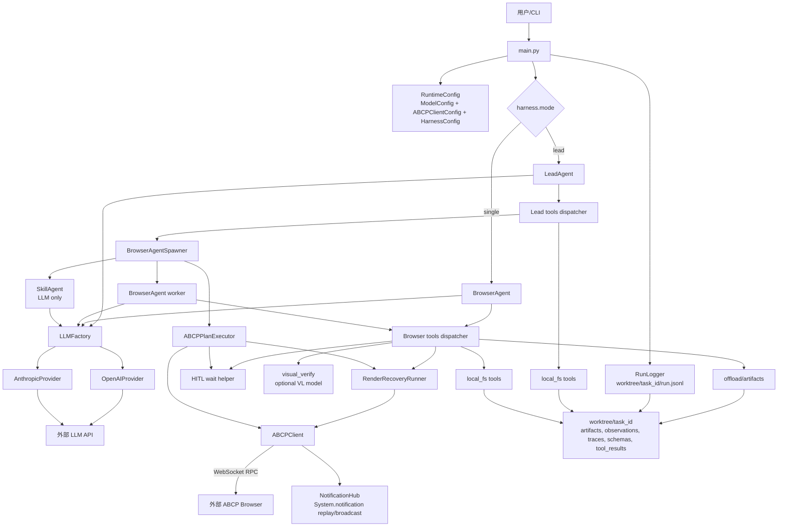
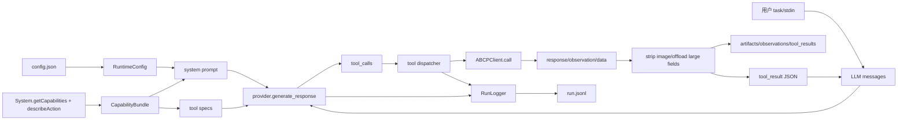
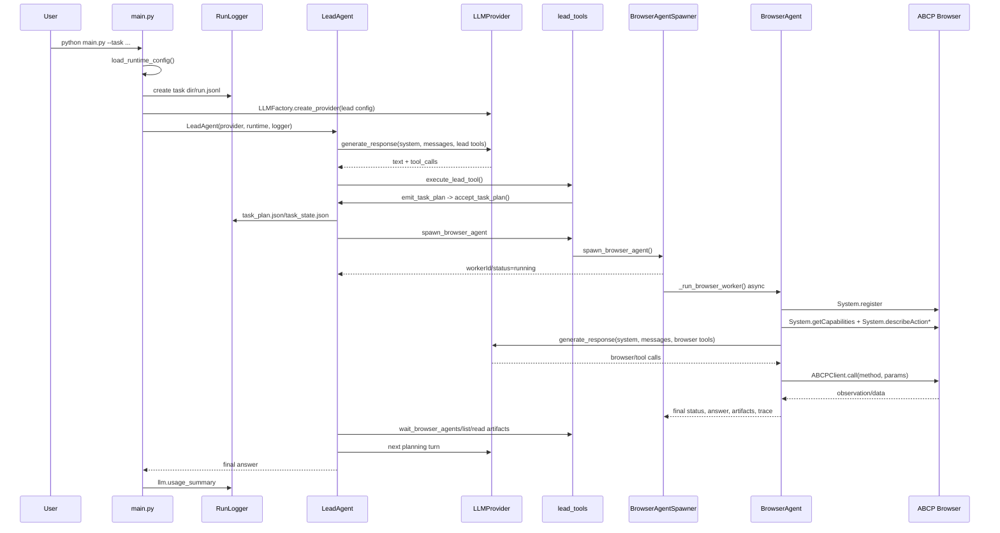
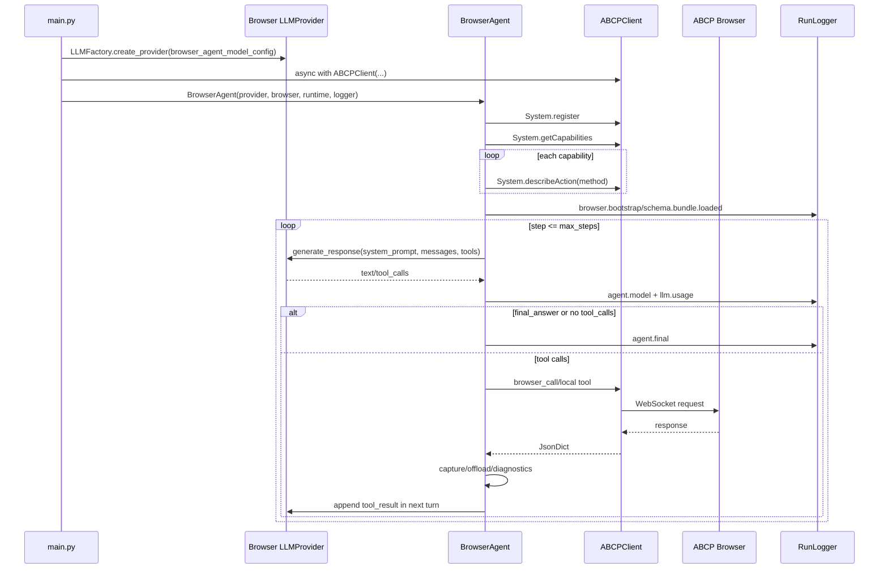
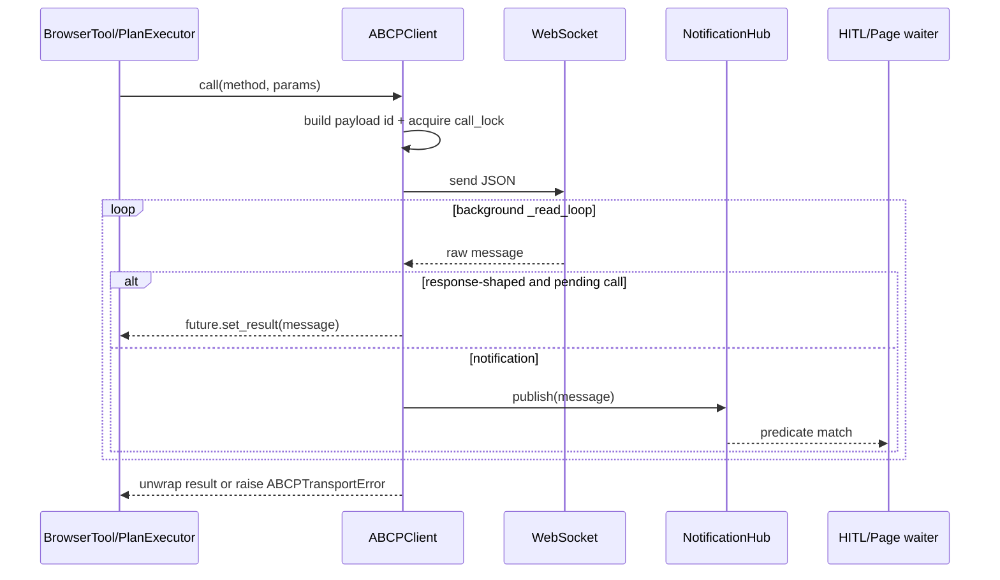
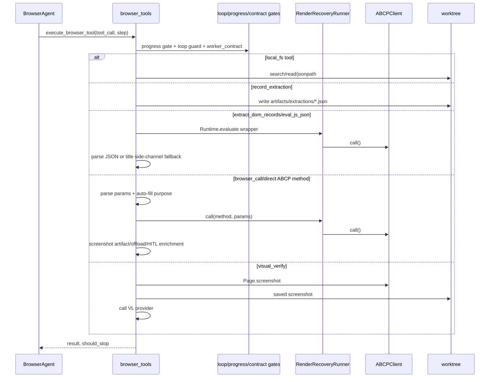
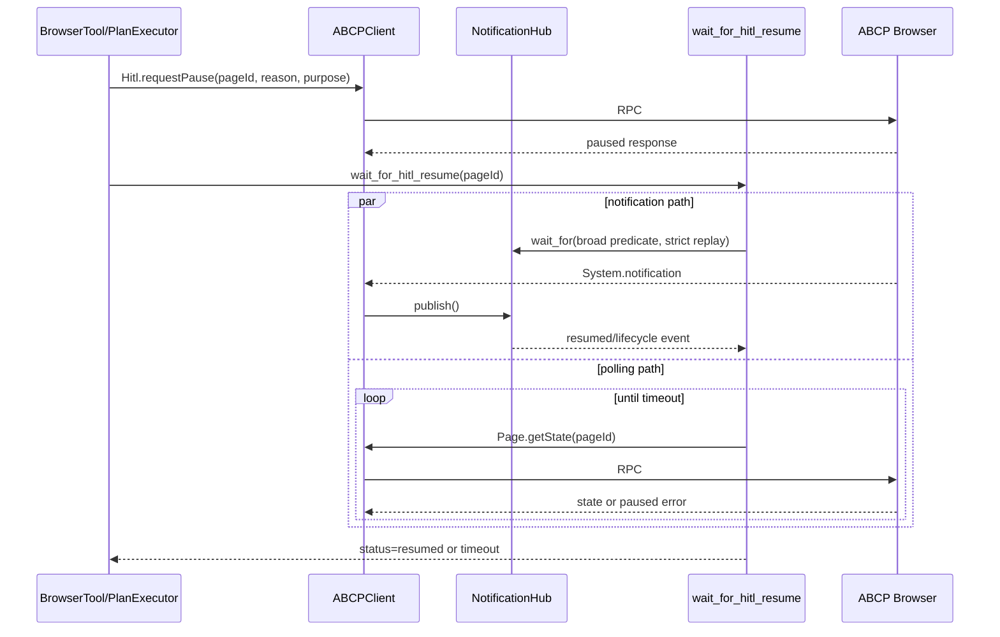
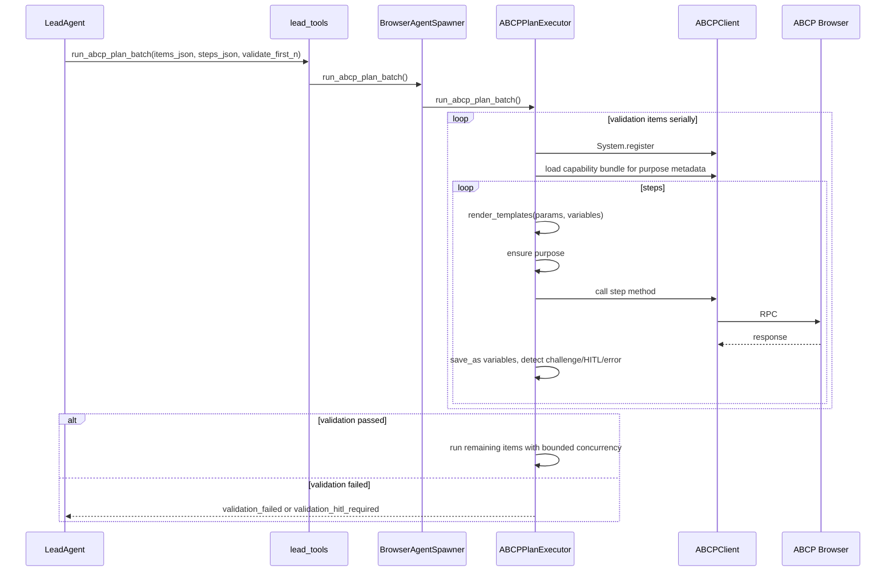

# Browser Agent Harness 技术架构图

本文档基于当前仓库代码生成，范围只覆盖 browser agent harness 系统，不展开 ABCP Browser 服务端实现。ABCP Browser 在本文中被视为外部 WebSocket/RPC 能力提供方。

## 范围

纳入核心架构：

- `main.py`
- `agent_harness.py`
- `abcp_client.py`
- `harness/**`
- `harness/tools/**`
- `llm/**`
- `llm_provider.py`
- `probe_schema.py`
- `probe_runtime_eval.py`

默认不纳入核心 harness：

- `recon/**`
- `scrape/**`
- `taaft_abcp_extract/**`
- `harness/hitl 2.py`
- `llm/anthropic_provider 2.py`

后两个带空格的文件当前没有被正常 import，按备份/残留文件处理。

## 总体架构

## 分层说明

| 层 | 模块 | 职责 |
| --- | --- | --- |
| CLI/配置层 | `main.py`, `harness/config.py`, `llm/config.py`, `abcp_client.py:ABCPClientConfig` | 读取 `config.json`、命令行任务、运行模式、模型配置、浏览器连接配置。 |
| 编排层 | `LeadAgent`, `BrowserAgent`, `BrowserAgentSpawner`, `ABCPPlanExecutor` | Lead 拆解任务并调度 worker/skill/plan；BrowserAgent 执行浏览器工具循环；PlanExecutor 执行确定性 ABCP step。 |
| 工具层 | `harness/tools/browser_tools.py`, `harness/tools/lead_tools.py` | 将模型 tool call 映射到本地工具、ABCP method、文件读取、批处理、最终回答。 |
| 传输层 | `ABCPClient`, `NotificationHub` | WebSocket 连接、请求封装、单飞 RPC、响应识别、通知广播与 replay。 |
| LLM 适配层 | `llm/base.py`, `llm/openai_provider.py`, `llm/anthropic_provider.py`, `llm/cache_control.py` | 统一 provider 接口，转换 Anthropic 风格 messages/tools 到具体厂商协议，处理 prompt cache marker 和回退。 |
| 数据/可观测层 | `RunLogger`, `offload`, `local_fs`, `schema_loader`, `compaction` | 写 JSONL 日志、artifact、schema 缓存、大响应下沉、上下文压缩、任务内只读查询。 |
| 安全/恢复层 | `diagnostics`, `hitl`, `render_recovery`, `progress`, `loop_guard`, `task_control` | 终态分类、HITL 等待、render 丢失恢复、循环防护、任务计划状态和 artifact 验收。 |
| 可选视觉层 | `harness/vl.py` | 对截图做有限视觉验收，不承担批量数据抽取。 |

## 核心数据流

## 运行时序图

### Lead 模式总时序

### Single BrowserAgent 模式

### ABCPClient RPC 与通知时序

### BrowserAgent 工具调用时序

### HITL 暂停/恢复时序

### 确定性 ABCP Plan 批处理时序

## 函数和类索引

说明：

- `返回/出参` 指函数返回值或对象产物；文件写入、日志写入、网络调用列在 `副作用`。
- `self`/`cls` 省略。
- 私有函数也列出，因为它们承载了实际控制逻辑。

### `main.py`

| 符号 | 功能/用途 | 入参 | 返回/出参 | 副作用 |
| --- | --- | --- | --- | --- |
| `ConsoleProgressReporter` | CLI 进度格式化器 | 无 | callable reporter | stdout 输出 |
| `ConsoleProgressReporter.__init__` | 初始化 transport method 记忆 | 无 | `None` | 修改实例状态 |
| `ConsoleProgressReporter.__call__` | 接收 logger event 并打印格式化进度 | `event_type`, `payload` | `None` | stdout |
| `ConsoleProgressReporter._format` | 按 event type 生成中文状态文本 | `event_type`, `payload` | `Optional[str]` | 无 |
| `_format_model_event` | 格式化模型输出和工具调用摘要 | `event_type`, `payload` | `str` | 无 |
| `_format_tool_call` | 格式化单个 tool call | `tool_call` | `str` | 无 |
| `_format_params_summary` | 压缩参数字典展示 | `params` | `str` | 无 |
| `_short_text` | 截断单行文本 | `value`, `max_len` | `str` | 无 |
| `_format_error` | 格式化 browser error | `payload` | `str` | 无 |
| `_format_browser_result` | 格式化 worker 结果 | `payload` | `str` | 无 |
| `load_runtime_config` | 从 JSON 组装 `RuntimeConfig` | `config_path` | `RuntimeConfig` | 读取配置文件、环境变量 |
| `read_task` | 从 `--task`、位置参数、stdin 或交互输入读取任务 | `args` | `str` | 可能读取 stdin/input |
| `run_cli` | CLI 主流程，按 mode 调用 LeadAgent/BrowserAgent | `args` | exit code `int` | 创建 run 目录、调用 LLM/浏览器、写日志 |
| `build_arg_parser` | 构造命令行参数 parser | 无 | `ArgumentParser` | 无 |
| `main` | 同步入口，包装 `asyncio.run` 和 Ctrl-C | `argv=None` | exit code `int` | 可能写 cancelled 日志 |

### `agent_harness.py`

| 符号 | 功能/用途 | 入参 | 返回/出参 | 副作用 |
| --- | --- | --- | --- | --- |
| `_is_context_limit_exception` | 识别 provider 上下文窗口错误 | `exc` | `bool` | 无 |
| `offload_tool_result_for_model` | 统一对 tool result 做大对象下沉 | `logger`, `runtime`, `tool_call`, `result`, `step` | 原对象或 offload stub | 可能写 `tool_results/*.json` |
| `BrowserAgent` | 单浏览器 worker，负责 LLM-browser 工具循环 | `provider`, `browser`, `runtime`, `logger` | agent 实例 | 保存运行状态 |
| `BrowserAgent.run` | 执行任务直到 final、step cap 或异常 | `task` | `str final_answer` | 调 LLM、浏览器、写日志/artifact |
| `_bootstrap_browser` | 注册 agent、加载 capability/schema/skillsDoc | 无 | `JsonDict bootstrap` | 调 ABCP、写 schemas 和日志 |
| `_build_dynamic_context` | 生成动态上下文 JSON | `bootstrap` | `str` | 无 |
| `_build_system_prompt` | 生成 BrowserAgent 系统提示词 | 无 | `str` | 无 |
| `_capture_artifacts` | 截图响应落盘并移除 base64 | `method`, `response` | response/stub | 写 artifacts |
| `_offload_response` | DOM/AXTree 等大字段下沉 | `method`, `params`, `response`, `step` | response/stub | 写 observations |
| `_to_model_json` | 将结果裁剪后序列化给模型 | `value` | `str` | 无 |
| `_trim_for_model` | 按 harness 限额裁剪字符串 | `value` | `Any` | 无 |
| `_trim_for_log` | 日志裁剪 | `value` | `Any` | 无 |
| `_maybe_apply_step_cap_reminder` | 临近 step cap 时追加临时提醒 | `system_prompt`, `step`, `max_steps` | `str` | 写 reminder 日志 |
| `_observe_tool_result` | 将 browser call 结果喂给 diagnostics | `tool_call`, `result` | `None` | 更新 diagnostics |
| `_has_extraction_artifact` | 判断是否已有 extraction artifact | 无 | `bool` | 无 |
| `_compose_step_cap_message` | 根据终态生成 step cap 文案 | `final_status` | `str` | 无 |
| `_write_agent_final` | 写 `agent.final` 事件 | `final_status`, `final_answer`, `model_reported_status`, `override_reason`, `reached_step_cap` | `None` | 写日志 |
| `LeadAgent` | 多 agent 编排器 | `provider`, `runtime`, `logger` | agent 实例 | 持有 spawner 和 task plan |
| `LeadAgent.accept_task_plan` | 校验并落盘任务计划 | `raw_plan` | `JsonDict` | 写 `task_plan.json`、`task_state.json` |
| `resolve_phase_for_spawn` | 找指定或下一个 pending phase | `phase_id` | `Optional[JsonDict]` | 读 task state |
| `build_worker_contract` | 合并 phase contract 和 override | `phase`, `override=None` | `JsonDict` | 无 |
| `LeadAgent.run` | LeadAgent 主循环 | `task` | `str final_answer` | 调 LLM、工具、worker，写日志 |
| `LeadAgent._build_system_prompt` | 生成 LeadAgent 系统提示词 | 无 | `str` | 无 |

### `abcp_client.py`

| 符号 | 功能/用途 | 入参 | 返回/出参 | 副作用 |
| --- | --- | --- | --- | --- |
| `ABCPTransportError` | WebSocket/RPC 失败异常 | message | exception | 无 |
| `_NotificationWaiter` | 内部 wait_for 记录 | `predicate`, `future` | dataclass | 无 |
| `NotificationHub` | 通知广播、订阅和 replay buffer | `replay_size=64`, `replay_ttl_seconds=30` | hub 实例 | 维护 waiters/subscribers |
| `NotificationHub.publish` | 发布通知给 waiters/subscribers | `message` | `None` | 唤醒 future、调用 subscriber |
| `NotificationHub.wait_for` | 等待匹配通知 | `predicate`, `timeout`, `replay_window_seconds`, `replay_predicate` | `Optional[JsonDict]` | 注册/移除 waiter |
| `NotificationHub.peek_replay` | 扫 replay buffer | `predicate`, `window_seconds` | `Optional[JsonDict]` | 无 |
| `NotificationHub.subscribe` | 注册被动订阅者 | `callback` | `unsubscribe()` | 修改 subscribers |
| `NotificationHub.close` | 关闭 hub 并取消等待 | 无 | `None` | 清空 waiters/replay |
| `_connect_supports_proxy_arg` | 检查 websockets.connect 是否支持 proxy 参数 | 无 | `bool` | 反射 SDK signature |
| `_is_local_ws_url` | 判断 ws URL 是否本地 | `ws_url` | `bool` | 无 |
| `ABCPClientConfig` | 浏览器连接配置 | dataclass fields | config 实例 | 无 |
| `ABCPClientConfig.from_dict` | 从 dict/环境变量构造配置 | `data` | `ABCPClientConfig` | 读 JWT 环境变量 |
| `ABCPClient` | ABCP WebSocket RPC 客户端 | `config`, `on_event=None` | client 实例 | 持有 socket/read task |
| `__aenter__`/`__aexit__` | async context 管理 | context args | client/None | connect/close |
| `connect` | 建立 WebSocket 并启动 reader | 无 | `None` | 网络连接、创建 background task |
| `close` | 关闭 reader/socket/hub | 无 | `None` | 取消任务、关闭 socket |
| `call` | 单飞 RPC 调用 | `method`, `params=None` | `JsonDict` | 发送 WebSocket、等待响应、写 transport event |
| `wait_for_notification` | 代理到 NotificationHub.wait_for | `predicate`, `timeout`, replay 参数 | `Optional[JsonDict]` | 注册 waiter |
| `subscribe_notifications` | 订阅通知 | `callback` | `unsubscribe()` | 修改 hub |
| `_read_loop` | 后台读取 WebSocket | 无 | `None` | 分发消息、处理 transport failure |
| `_dispatch_message` | 响应/通知分流 | `message` | `None` | resolve pending future 或 publish |
| `_is_response_for_pending` | 判断消息是否当前 RPC 响应 | `message` | `bool` | 无 |
| `_is_implicit_error_envelope` | 区分真实 JSON-RPC error 与 domain error | `message` | `bool` | 无 |
| `_fail_pending` | 使当前 pending call 失败 | `exc` | `None` | set_exception |
| `_build_payload` | 根据 request shape 构造请求 | `request_id`, `method`, `params` | `JsonDict` | 无 |
| `_decode_message` | bytes/string 到 dict | `raw` | `JsonDict` | 无 |
| `_unwrap_response` | 展开 `result` 或 `payload` | `message` | `JsonDict` | 无 |
| `_format_jsonrpc_error` | 格式化 JSON-RPC 错误 | `method`, `message` | `str` | 无 |
| `_emit` | 回调 transport event | `event_type`, `payload` | `None` | 调用 `on_event` |

### 配置、schema 和公共工具

| 文件/符号 | 功能/用途 | 入参 | 返回/出参 | 副作用 |
| --- | --- | --- | --- | --- |
| `harness/config.py:VLConfig` | VL 配置 | dataclass fields | config | 无 |
| `VLConfig.from_dict` | 从 dict 解析 VL 配置 | `data` | `VLConfig` | 无 |
| `HarnessConfig` | harness 运行配置 | dataclass fields | config | 无 |
| `HarnessConfig.from_dict` | 从 dict 解析 harness 配置 | `data` | `HarnessConfig` | 无 |
| `RuntimeConfig` | 顶层运行配置聚合 | `agent_id`, `model`, `browser`, `harness` | config | 无 |
| `schema_loader.CapabilityBundle` | capability/schema/skillsDoc 聚合 | fields | bundle | 无 |
| `load_capability_bundle` | 通过 `System.getCapabilities` + `System.describeAction` 加载能力 | `browser`, `logger`, `blocked_methods=()`, `schemas_dir=None`, `describe_concurrency=8` | `CapabilityBundle` | 调 ABCP、写 schema 文件、写日志 |
| `required_param_names` | 取 required 参数名 | `schema` | `List[str]` | 无 |
| `build_capability_digest` | 生成 prompt 用能力摘要 | `bundle` | `str` | 无 |
| `model_config.browser_agent_model_config` | 给 BrowserAgent 模型配置加 `tool_choice=required` | `model` | `ModelConfig` | 无 |
| `model_config.lead_agent_model_config` | 给 LeadAgent 模型配置加 `tool_choice=required` | `model` | `ModelConfig` | 无 |
| `templates.get_path` | 从 dict/list 按点路径取值 | `value`, `path` | `Any` | 无 |
| `templates.render_templates` | 递归替换 `{path}` 模板 | `value`, `variables` | `Any` | 无 |

### `harness/tools/browser_tools.py`

| 符号 | 功能/用途 | 入参 | 返回/出参 | 副作用 |
| --- | --- | --- | --- | --- |
| `build_browser_tool_dispatcher` | 生成 BrowserAgent tool dispatcher | `agent` | async dispatcher | 无 |
| `execute_browser_tool` | BrowserAgent 工具总分发 | `agent`, `tool_call`, `step` | `(JsonDict, bool should_stop)` | 可能调浏览器、写日志/artifact |
| `_invoke_browser_method` | 调 ABCP method 并统一 recovery/offload/diagnostics | `agent`, `method`, `params`, `step` | `JsonDict` | 调浏览器、写日志 |
| `_extract_dom_records` | 用内置 JS 从 DOM 重复节点抽 rows | `agent`, `tool_input`, `step` | `JsonDict` | 调 Runtime.evaluate、可写 extraction artifact |
| `_eval_js_json_tool` | 执行 JS 表达式并强制 JSON 返回 | `agent`, `tool_input`, `step` | `JsonDict` | 调 Runtime.evaluate、可写 artifact |
| `_navigate_verified` | 导航后轮询验证 URL/title | `agent`, `tool_input`, `step` | `JsonDict` | 调 Page.navigate/Page.getState |
| `_visual_verify` | 截图并调用 VL 验证 | `agent`, `tool_input`, `step` | `JsonDict` | 写截图、调 VL API |
| `_screenshot_saved_path` | 从截图结果中取本地路径 | `result` | `Optional[str]` | 无 |
| `_build_extract_dom_records_expression` | 构造 DOM rows 抽取 IIFE | `selector`, `fields`, `visible_only`, `include_rect`, `include_ancestor_text`, `limit` | `str` | 无 |
| `_runtime_json_payload` | 从 Runtime.evaluate result 解析 `{rows/error}` JSON | `result` | `Optional[Any]` | 无 |
| `_runtime_any_json_payload` | 从 Runtime.evaluate result 解析任意 JSON | `result` | `Optional[Any]` | 无 |
| `_build_eval_js_json_expression` | 包装 JS expression 为 JSON stringify | `expression` | `str` | 无 |
| `_rows_from_eval_value` | 将 list 或 `{rows}` 规范成 `List[JsonDict]` | `value` | `Optional[List[JsonDict]]` | 无 |
| `_eval_json_via_title` | Runtime 返回异常时用 `document.title` 分块 side-channel 传 JSON | `agent`, `page_id`, `json_string_expression`, `step`, `purpose`, `chunk_chars=700`, `max_chunks=300` | `Optional[Any]` | 多次调 Runtime.evaluate/Page.getState |
| `_response_data` | 从 tool result 取 `response.data` | `result` | `JsonDict` | 无 |
| `_check_extraction_progress_gate` | 防止抽到 rows 后不 record | `agent`, `next_tool` | `Optional[JsonDict]` | 更新 pending 计数 |
| `_check_worker_contract` | 执行 allowed/forbidden/max_surface_attempts 合约 | `agent`, `method_or_tool` | `Optional[JsonDict]` | 更新 attempts |
| `_check_progress_before` | 调用 `ProgressAccountant.before_tool` | `agent`, `tool_name` | `Optional[JsonDict]` | 可能写 progress 日志 |
| `_observe_progress_after` | 调用 `ProgressAccountant.after_tool` | `agent`, `tool_name`, `result=None` | `None` | 写 progress snapshot |
| `_record_extraction` | 保存结构化 rows artifact | `agent`, `tool_input` | `JsonDict` | 写 `artifacts/extractions/*.json` |
| `_hitl_pause_succeeded` | 判断 `Hitl.requestPause` 是否成功 | `response` | `bool` | 无 |
| `_enrich_pause_with_wait` | 成功 pause 后接管等待并扩展 response | `agent`, `params`, `response`, `step` | `JsonDict` | 等待通知/轮询，写 HITL 日志 |
| `build_browser_agent_tool_specs` | 构造 BrowserAgent tool schema | `capability_methods` | `List[JsonDict]` | 无 |

### `harness/tools/lead_tools.py`

| 符号 | 功能/用途 | 入参 | 返回/出参 | 副作用 |
| --- | --- | --- | --- | --- |
| `build_lead_tool_dispatcher` | 生成 LeadAgent tool dispatcher | `agent` | async dispatcher | 无 |
| `execute_lead_tool` | LeadAgent 工具总分发 | `agent`, `tool_call` | `(JsonDict, bool should_stop)` | 可能 spawn worker、读文件、调 LLM/plan |
| `build_lead_agent_tool_specs` | 构造 LeadAgent tool schema | 无 | `List[JsonDict]` | 无 |

### `harness/tools/parsers.py` 和 `loop_guard.py`

| 符号 | 功能/用途 | 入参 | 返回/出参 | 副作用 |
| --- | --- | --- | --- | --- |
| `parse_browser_call_params` | 校验 `browser_call.params` | `tool_input` | `(params, error)` | 无 |
| `parse_direct_capability_params` | 解析直接 capability tool 参数 | `tool_input` | `(params, error)` | 无 |
| `ensure_required_purpose` | 给 requiresPurpose 的 ABCP method 自动填 purpose | `methods_requiring_purpose`, `method`, `params`, `reason`, `purpose_hints=None` | `bool changed` | 修改 `params` |
| `method_schema_summary` | 压缩 method schema 供错误提示 | `method_schemas`, `method` | `Optional[JsonDict]` | 无 |
| `attach_method_schema` | 将 schema 摘要挂到 result | `result`, `method`, `method_schemas` | `None` | 修改 `result` |
| `lead_tool_parse_error` | 构造并记录 Lead tool 参数错误 | `agent`, `tool_name`, `field`, `error`, `expected` | `JsonDict` | 写日志 |
| `parse_json_text` | 从字符串字段解析 JSON 并校验类型 | `agent`, `tool_name`, `field`, `raw_value`, `expected_type`, `expected` | `(Any, Optional[JsonDict])` | 可能写日志 |
| `parse_json_arg` | 从 tool_input 指定字段解析 JSON | `agent`, `tool_name`, `tool_input`, `field`, `expected_type`, `expected` | `(Any, Optional[JsonDict])` | 可能写日志 |
| `parse_plan_steps_arg` | 解析确定性 plan steps | `agent`, `tool_name`, `tool_input` | `(List[JsonDict], Optional[JsonDict])` | 可能写日志 |
| `tool_call_signature` | 对 tool name/input 生成稳定 hash | `name`, `tool_input` | `str` | 无 |
| `trailing_streak` | 计算尾部重复调用次数 | `history`, `signature` | `int` | 无 |
| `check_tool_call_loop` | 拦截重复 tool call 循环 | `agent`, `name`, `tool_input`, `step`, `warn_at=3`, `force_stop_at=5` | `Optional[(JsonDict, bool)]` | 更新 recent signatures、写日志 |

### `harness/spawner.py`

| 符号 | 功能/用途 | 入参 | 返回/出参 | 副作用 |
| --- | --- | --- | --- | --- |
| `BrowserAgentHandle` | worker 句柄元数据 | dataclass fields | handle | 无 |
| `BrowserAgentSpawner` | 创建和管理 BrowserAgent、SkillAgent、PlanExecutor | `runtime`, `logger`, `browser_agent_factory` | spawner | 持有 handles |
| `spawn_browser_agent` | 异步启动一个 BrowserAgent | `task`, `context=''`, `name=None`, `max_steps=None`, `result_contract=''`, `phase_id=None`, `worker_contract=None` | `JsonDict` | 创建 asyncio task、更新 task_state、写日志 |
| `wait_browser_agents` | 等待指定/all workers | `worker_ids=None`, `mode='all'`, `timeout_seconds=None` | `JsonDict` | 等待 asyncio tasks |
| `run_browser_batch` | 模板化并发跑多个 BrowserAgent | `items`, `task_template`, `context_template=''`, `concurrency=None`, `max_steps=None` | `JsonDict` | 创建多个 worker |
| `run_skill_agent` | 无浏览器 SkillAgent 总结策略/模板 | `task`, `input_context=''`, `output_schema=''`, `evidence_artifacts=None` | `JsonDict` | 调 LLM、读 evidence artifact、写日志 |
| `_render_evidence_block` | 安全读取 extraction artifacts 供 SkillAgent | `paths` | `(block_text, summary)` | 读文件 |
| `_evidence_allowed_root` | evidence sandbox 根路径 | 无 | `Optional[Path]` | 无 |
| `execute_abcp_plan` | 代理到 `ABCPPlanExecutor.execute_abcp_plan` | `steps`, `variables=None`, `agent_name=None`, `context=''` | `JsonDict` | 调 plan executor |
| `run_abcp_plan_batch` | 代理到 plan batch | `items`, `steps`, `variables=None`, `context_template=''`, `concurrency=None`, `validate_first_n=None` | `JsonDict` | 调 plan executor |
| `list_browser_agents` | 列 worker 状态 | 无 | `JsonDict` | 读取 task 状态 |
| `shutdown` | 取消未完成 workers | 无 | `None` | cancel tasks |
| `_run_browser_worker` | 单 worker 实际执行体 | `worker_id`, `agent_id`, `name`, `task`, `context`, `max_steps`, `result_contract`, `phase_id`, `worker_contract` | `JsonDict` | 创建 ABCPClient、跑 BrowserAgent、写 trace/log/state |
| `_write_worker_trace` | 写 worker trace JSONL | `worker_id`, `trace` | `str path` | 写 `traces/*.jsonl` |
| `_summarize_worker_trace` | 汇总 trace 方法、错误、pageIds、offloads | `trace` | `JsonDict` | 无 |
| `_select_handles` | 选择 worker handles | `worker_ids` | `List[BrowserAgentHandle]` | 无 |
| `_task_result` | 安全取 asyncio task result | `handle` | `JsonDict` | 无 |
| `_next_id` | 生成递增 worker id | `prefix` | `str` | 更新 counter |

### `harness/plan_executor.py`

| 符号 | 功能/用途 | 入参 | 返回/出参 | 副作用 |
| --- | --- | --- | --- | --- |
| `ABCPPlanExecutor` | 确定性 ABCP step 执行器 | `runtime`, `logger`, `next_id` | executor | 持有 purpose metadata |
| `execute_abcp_plan` | 单 item 串行执行 steps | `steps`, `variables=None`, `agent_name=None`, `context=''` | `JsonDict` | 创建 plan worker |
| `run_abcp_plan_batch` | 多 item plan 批执行，支持前 N 个串行验证 | `items`, `steps`, `variables=None`, `context_template=''`, `concurrency=None`, `validate_first_n=None` | `JsonDict` | 并发创建 plan workers、写日志 |
| `_summarize_plan_batch_item` | 压缩单个 batch 结果 | `result` | `JsonDict` | 无 |
| `_summarize_plan_batch_failure` | 压缩失败详情 | `result` | `JsonDict` | 无 |
| `_summarize_failed_step_results` | 从 step results 取失败信号样本 | `step_results` | `List[JsonDict]` | 无 |
| `_extract_plan_batch_output` | 从成功 step results 中提取 output | `result` | `Any` | 无 |
| `_detect_challenge` | 关键词识别 CAPTCHA/人机验证 | `value` | `Optional[str]` | 无 |
| `_detect_navigation_title_challenge` | 从导航标题识别 challenge | `method`, `response` | `Optional[str]` | 无 |
| `_extract_title` | 深搜 title 字段 | `value` | `Optional[str]` | 无 |
| `_is_page_paused_error` | 判断 paused error | `value` | `bool` | 无 |
| `_request_pause_and_wait_for_hitl` | 主动发 HITL pause 并等待恢复 | `browser`, `page_id`, `reason`, `worker_id`, `step_index` | `JsonDict` | 调 ABCP/HITL helper、写日志 |
| `_wait_for_hitl_resume` | 包装共享 HITL helper | `browser`, `page_id`, `worker_id`, `step_index` | `JsonDict` | 等待通知/轮询 |
| `_probe_challenge_after_failure` | 失败后用 AXTree 探测 challenge | `browser`, `page_id` | `Optional[JsonDict]` | 调 ABCP |
| `_ensure_purpose_capabilities` | 懒加载 requiresPurpose metadata | `browser` | `None` | 调 schema loader |
| `_ensure_plan_step_purpose` | 为 plan step 自动填 purpose | `method`, `params`, `step`, `step_index`, `context`, `variables` | `None` | 修改 `params` |
| `_execute_abcp_plan_worker` | 单 plan worker 执行主体 | `worker_id`, `agent_id`, `steps`, `variables`, `agent_name`, `context` | `JsonDict` | 创建 ABCPClient、执行 steps、写 artifact/log |
| `_capture_plan_artifact` | plan 截图响应落盘 | `worker_id`, `method`, `response`, `artifacts` | `JsonDict` | 写 artifacts |
| `_offload_plan_response` | plan 大响应下沉 | `worker_id`, `method`, `params`, `response`, `step` | `Any` | 写 observations |

### `harness/task_control.py`

| 符号 | 功能/用途 | 入参 | 返回/出参 | 副作用 |
| --- | --- | --- | --- | --- |
| `utc_now_iso` | 当前 UTC ISO 时间 | 无 | `str` | 无 |
| `validate_task_plan` | 校验/规范 v1 线性 phase plan | `raw_plan` | `(plan or None, errors)` | 无 |
| `phase_contract` | 合并 phase/override 为 worker contract | `phase`, `override=None` | `JsonDict` | 无 |
| `write_task_plan` | 写 task plan | `logger`, `plan` | `str path` | 写 `task_plan.json`、日志 |
| `initialize_task_state` | 初始化 task_state | `logger`, `plan` | `JsonDict` | 写 `task_state.json`、日志 |
| `load_task_state` | 读取 task_state | `logger` | `JsonDict` | 读文件 |
| `write_task_state` | 写 task_state | `logger`, `state` | `str path` | 写文件 |
| `mark_phase_running` | 标记 phase running | `logger`, `phase_id`, `worker_id`, `worker_name` | `None` | 修改 task_state |
| `mark_phase_result` | 记录 phase 结果和验证状态 | `logger`, `phase_id`, `worker_id`, `validation`, `result_status` | `None` | 修改 task_state |
| `next_pending_phase` | 找下一个未完成 phase，并处理尝试上限 | `plan`, `logger` | `Optional[JsonDict]` | 可能修改 task_state |
| `find_phase` | 按 id 查 phase | `plan`, `phase_id` | `Optional[JsonDict]` | 无 |
| `validate_worker_artifacts` | 根据 contract 验证 extraction artifacts | `contract`, `artifacts`, `task_dir` | `JsonDict` | 读 artifact |
| `_run_validator` | 执行单个 artifact validator | `validator`, `rows` | `List[JsonDict failures]` | 无 |
| `_validate_action_outcome` | 验证 URL/heading 等 action outcome | `validator`, `rows` | `List[JsonDict]` | 无 |
| `_compile_validator_regex` | 编译 validator regex | `pattern`, `validator` | `re.Pattern` | 无 |
| `_similarity` | 计算规范化文本相似度 | `left`, `right` | `float` | 无 |
| `_norm_compare_text` | 规范化比较文本 | `value` | `str` | 无 |
| `_float_value` | 安全转 float | `value`, `default` | `float` | 无 |
| `_normalize_validators` | 从 expected_artifact 和 validators 生成验证器列表 | `expected_artifact`, `validators`, `errors`, `phase_id` | `List[JsonDict]` | 可能追加 errors |
| `_load_extraction_artifacts` | 安全读取 extraction artifact JSON | `paths`, `task_dir` | `List[JsonDict]` | 读文件 |
| `_state_path` | task_state 路径 | `logger` | `Path` | 无 |
| `_first_phase_id` | 第一个 phase id | `plan` | `Optional[str]` | 无 |
| `_phase_state` | 从 state 取 phase state | `state`, `phase_id` | `Optional[JsonDict]` | 无 |
| `_string_list` | 列表转非空字符串列表 | `value` | `List[str]` | 无 |
| `_positive_int` | 正整数解析 | `value`, `default` | `int` | 无 |
| `_append_unique` | 追加去重 | `target`, `values` | `None` | 修改 `target` |

### 本地文件、offload、上下文压缩

| 文件/符号 | 功能/用途 | 入参 | 返回/出参 | 副作用 |
| --- | --- | --- | --- | --- |
| `local_fs_search` | 任务 worktree 内只读搜索/列文件 | `logger`, `glob_pattern`, `pattern=None`, `event_type=None`, caps | `JsonDict` | 读文件 |
| `local_fs_read` | 任务 worktree 内按行读取文件 | `logger`, `path`, `line_offset=0`, `line_limit=200`, `max_bytes=DEFAULT` | `JsonDict` | 读文件 |
| `_jsonpath_descendants` | JSONPath 递归下降 | `value`, `key` | `List[Any]` | 无 |
| `jsonpath_query` | JSONPath 子集查询 | `value`, `path`, `max_nodes` | `(matches, truncated, error)` | 无 |
| `local_fs_jsonpath` | 对 JSON/JSONL 文件执行 JSONPath | `logger`, `path`, `expr`, `mode='auto'`, `max_nodes=50`, `max_bytes_per_node=1000` | `JsonDict` | 读文件 |
| `write_offloaded_blob` | 写 offload blob 为 text/json | `path`, `field`, `blob` | `(format, query_with, outline)` | 写文件 |
| `outline_large_field` | 大字段只保留 outline | `value`, `max_bytes=2000` | `Any` | 无 |
| `offload_large_tool_result` | 大 tool result 下沉为 stub | `logger`, `tool_name`, `result`, `step`, `prefix=''`, `threshold_bytes=50000` | `Any` | 写 `tool_results` |
| `offload_large_response_fields` | ABCP 响应大字段下沉 | `logger`, `method`, `params`, `response`, `step`, `prefix=''`, `threshold_bytes=8000` | `Any` | 写 `observations` |
| `strip_image_payload` | 截图 base64 转图片 artifact | `logger`, `method`, `response`, `artifacts`, `prefix=''` | `JsonDict` | 写图片文件、修改 artifacts |
| `message_has_block` | 判断消息含某 block type | `message`, `block_type` | `bool` | 无 |
| `message_blocks` | 取消息 block dict 列表 | `message` | `List[JsonDict]` | 无 |
| `message_tool_use_ids` | 取 assistant tool_use ids | `message` | `List[str]` | 无 |
| `message_tool_result_ids` | 取 user tool_result ids | `message` | `List[str]` | 无 |
| `_ids_match` | 判断 tool_use/result id 是否配对 | `left`, `right` | `bool` | 无 |
| `validate_tool_pairing` | 校验 Anthropic 工具配对合法性 | `messages` | `Optional[str error]` | 无 |
| `estimate_prompt_tokens` | 粗略估算 prompt tokens | `system_prompt`, `messages`, `tools` | `int` | 无 |
| `split_message_pairs` | 按 tool_use/tool_result 对消息分组 | `messages` | `(head, groups)` | 无 |
| `summarize_messages_for_compaction` | 汇总被压缩的中间消息 | `groups` | `JsonDict` | 无 |
| `make_compaction_message` | 构造压缩摘要消息 | `summary` | `JsonDict` | 无 |
| `assemble_compacted_messages` | 重组压缩后的消息 | `head_messages`, `head_groups`, `tail_groups`, `compacted_message` | `List[JsonDict]` | 无 |
| `compact_messages_if_needed` | 超上下文阈值时配对安全压缩 | `logger`, `actor`, `step`, `system_prompt`, `messages`, `tools`, `config` | `List[JsonDict]` | 写 `context_compactions` 和日志 |

### diagnostics、HITL、render recovery、progress、VL

| 文件/符号 | 功能/用途 | 入参 | 返回/出参 | 副作用 |
| --- | --- | --- | --- | --- |
| `WorkerDiagnostics` | worker 运行信号计数器 | dataclass fields | diagnostics | 无 |
| `observe_browser_call` | 从 browser call 结果提取 contract/page/extraction/HITL 信号 | `method`, `params`, `result` | `None` | 更新 diagnostics |
| `record_exception` | 记录异常类型和消息 | `exc` | `None` | 更新 diagnostics |
| `mark_hitl_wait_entered` | 标记进入 HITL wait | 无 | `None` | 更新 diagnostics |
| `mark_hitl_wait_timed_out` | 标记 HITL timeout | 无 | `None` | 更新 diagnostics |
| `mark_hitl_resumed` | 标记 HITL resumed 并清 pause | 无 | `None` | 更新 diagnostics |
| `to_log_payload` | diagnostics 日志化 | 无 | `Dict[str, Any]` | 无 |
| `classify_terminal_status` | worker 终态分类 | `diagnostics`, `model_reported_status`, `reached_step_cap`, `has_extraction_artifact=False` | `(status, override_reason)` | 无 |
| `status_category` | 终态转粗粒度类别 | `status` | `str` | 无 |
| diagnostics 私有 helpers | hard signal/HITL/context/page/extraction 检测 | 各自参数 | bool/status/文本 | 无 |
| `_make_resume_predicate_broad` | HITL live 通知谓词 | `page_id` | predicate | 无 |
| `_make_resume_predicate_strict` | HITL replay 安全谓词 | `page_id` | predicate | 无 |
| `_state_indicates_still_paused` | 判断 Page.getState 是否仍 paused | `state_response` | `bool` | 无 |
| `wait_for_hitl_resume` | 并行等待通知和 Page.getState 轮询 | `browser`, `page_id`, `timeout_seconds`, `poll_interval_seconds`, `diagnostics`, `logger` | `Dict[str, Any]` | 调 ABCP、写 HITL 日志、更新 diagnostics |
| `_slim_evidence` | 缩小 HITL evidence | `value` | `Any` | 无 |
| `RenderRecoveryOutcome` | render recovery 结果结构 | dataclass fields | outcome | 无 |
| `RenderRecoveryOutcome.to_dict` | 日志化 recovery outcome | 无 | `JsonDict` | 无 |
| `RenderRecoveryRunner` | 包装 render recovery call | `browser`, `logger`, `capability_methods`, `recent_recoveries=None` | runner | 无 |
| `RenderRecoveryRunner.call` | 调 `call_with_render_recovery` | `method`, `params` | `(JsonDict, Optional[RenderRecoveryOutcome])` | 调浏览器 |
| `build_render_recovery_runner` | 构造 runner | `browser`, `logger`, `capability_methods`, `recent_recoveries=None` | `RenderRecoveryRunner` | 无 |
| `detect_render_lost` | 从响应/异常文本识别 render loss | `value` | `Optional[str]` | 无 |
| `extract_page_id_from_values` | 深搜 pageId | `*values` | `Optional[str]` | 无 |
| `extract_url_from_values` | 深搜 URL | `*values` | `Optional[str]` | 无 |
| `uses_dom_anchor` | 判断 params 是否使用 DOM anchor | `params` | `bool` | 无 |
| `can_retry_after_render_recovery` | 判断 recovery 后是否自动重试原调用 | `method`, `params`, `recovery` | `bool` | 无 |
| `build_render_recovery_advisory` | 构造不可自动重试时的建议响应 | `method`, `params`, `original`, `recovery` | `JsonDict` | 无 |
| `call_with_render_recovery` | 检测 render loss、尝试恢复、必要时重试 | `browser`, `logger`, `recent_recoveries`, `capability_methods`, `method`, `params` | `(JsonDict, Optional[RenderRecoveryOutcome])` | 调 ABCP、写日志 |
| `recover_render_context` | 尝试 getState/switchTo/navigate 恢复 | recovery 参数 | `RenderRecoveryOutcome` | 调 ABCP |
| `attempt_render_recovery_strategy` | 执行单个恢复策略 | `browser`, `logger`, `method`, `params`, `page_id`, `strategy`, `call_method`, `call_params` | `(Optional[JsonDict], Optional[str])` | 调 ABCP、写日志 |
| `log_render_recovery_result` | 写 recovery result 日志 | `logger`, `method`, `params`, `recovery` | `None` | 写日志 |
| `ProgressAccountant` | worker 进度会计 | dataclass fields | accountant | 无 |
| `ProgressAccountant.before_tool` | 工具执行前判定是否干预 | `tool_name`, `artifact_count`, `local_fs_limit`, `no_artifact_limit`, `requires_artifact` | `Optional[JsonDict]` | 更新 interventions |
| `ProgressAccountant.after_tool` | 工具执行后更新计数 | `tool_name`, `artifact_count`, `result=None` | `None` | 更新状态 |
| `ProgressAccountant.to_log_payload` | 进度状态日志化 | 无 | `JsonDict` | 无 |
| `extraction_artifact_count` | 计算 extraction artifacts 数量 | `artifacts` | `int` | 无 |
| `_local_result_signature` | local_fs 结果签名 | `result` | `Optional[str]` | 无 |
| `build_visual_verify_prompt` | 构造 VL prompt | `expected`, `mode`, `question` | `str` | 无 |
| `visual_verify_image` | 调 VL provider 验证截图 | `config`, `image_path`, `expected`, `mode='action_outcome'`, `question=''` | `JsonDict` | 读图片、调外部 LLM |
| `_call_openai_compatible` | OpenAI 视觉调用 | `config`, `image_b64`, `mime_type`, `prompt` | `(text, usage)` | 网络调用 |
| `_call_anthropic_compatible` | Anthropic 视觉调用 | 同上 | `(text, usage)` | 网络调用 |
| `_parse_json_object` | 从 VL 文本中解析 JSON object | `text` | `Optional[JsonDict]` | 无 |

注意：`ProgressAccountant` 当前没有在 `BrowserAgent.__init__` 或 `_run_browser_worker` 中实例化，`browser_tools` 只是通过 `getattr(agent, "progress", None)` 兼容调用。因此进度干预逻辑目前默认不生效，除非外部代码给 agent 注入 `progress`。

### `harness/utils.py`

| 符号 | 功能/用途 | 入参 | 返回/出参 | 副作用 |
| --- | --- | --- | --- | --- |
| `_resolve_context_file` | 解析 context_file 路径 | `context_file` | `Optional[Path]` | 无 |
| `build_static_context_block` | 读取静态上下文并算 hash | `context_file` | `(block, sha256)` | 读文件 |
| `_usage_int` | usage 字段转 int | `usage`, `key` | `int` | 无 |
| `_cache_rate` | 计算 cache hit/reuse rate | `cache_read`, `*parts` | `float` | 无 |
| `UsageState` | 单 conversation cache 诊断状态 | dataclass fields | state | 无 |
| `UsageBucket` | token usage 聚合桶 | fields | bucket | 无 |
| `UsageBucket.add` | 累加 token usage | `cache_read`, `cache_creation`, `uncached_input`, `output` | `None` | 修改 bucket |
| `UsageBucket.summary` | 输出 bucket 汇总 | 无 | `JsonDict` | 无 |
| `UsageAggregator` | 全任务 usage 聚合器 | fields | aggregator | 无 |
| `UsageAggregator.add` | 记录一次 LLM usage 并生成日志 payload | `usage`, `source`, `provider`, `model`, `conversation_id`, `context_hash=None` | `JsonDict` | 更新聚合状态 |
| `UsageAggregator.summary` | 生成任务级 usage summary | 无 | `JsonDict` | 无 |
| `RunLogger` | JSONL 日志和任务目录管理 | `worktree_dir`, `task_id=None`, `on_event=None` | logger | 创建目录 |
| `RunLogger.write` | 写一条 event | `event_type`, `payload` | `None` | 写 `run.jsonl`，调用 progress callback |
| `RunLogger.record_llm_usage` | 记录 LLM usage | `source`, `provider`, `model`, `usage`, `step=None`, `conversation_id=None`, `context_hash=None` | `JsonDict` | 写 `llm.usage` |
| `RunLogger.write_usage_summary` | 写一次 usage summary | 无 | `None` | 写 `llm.usage_summary` |
| `make_browser_event_logger` | 构造 browser transport event callback | `logger`, `enabled`, `prefix='browser.transport'` | `Optional[callback]` | callback 会写日志 |
| `trim_large_strings` | 递归裁剪长字符串 | `value`, `max_chars` | `Any` | 无 |
| `json_size_bytes` | JSON 序列化大小 | `value` | `int` | 无 |
| `safe_path_component` | 文件名安全化 | `value`, `fallback='item'` | `str` | 无 |
| `task_subdir` | 创建任务子目录 | `logger`, `name` | `Path` | 创建目录 |
| `resolve_task_file` | 将模型给的路径限制在 task_dir 内 | `logger`, `raw_path` | `(Optional[Path], Optional[str])` | 无 |
| `extract_offloaded_paths` | 深搜 offload savedPath | `value` | `List[str]` | 无 |
| `outline_value` | 生成 JSON 值结构摘要 | `value`, `max_items=10`, `depth=2` | `Any` | 无 |
| `count_json_nodes` | 统计 JSON 节点数 | `value` | `int` | 无 |
| `truncate_utf8_text` | 按字节截断 UTF-8 文本 | `text`, `max_bytes` | `(text, truncated)` | 无 |
| `fit_json_node_for_output` | 将单个 JSON node 压到字节预算内 | `value`, `max_bytes` | `Any` | 无 |
| `optional_int` | 安全转 int | `value`, `default=None` | `Optional[int]` | 无 |
| `optional_float` | 安全转 float | `value`, `default=None` | `Optional[float]` | 无 |
| `exception_payload` | 异常转日志 payload | `exc`, `**extra` | `JsonDict` | 无 |

### LLM 层

| 文件/符号 | 功能/用途 | 入参 | 返回/出参 | 副作用 |
| --- | --- | --- | --- | --- |
| `BaseLLMProvider` | 统一 LLM provider 抽象 | `config` | provider | 无 |
| `BaseLLMProvider.generate_response` | provider 统一接口 | `system_prompt`, `messages`, `tools` | `(text, tool_calls, stop_reason, usage)` | 抽象方法 |
| `ModelConfig` | 模型连接配置 | dataclass fields | config | 无 |
| `ModelConfig.load_from_file` | 从配置文件和环境变量读取模型配置 | `filepath` | `ModelConfig` | 读文件/环境变量 |
| `ModelConfig._env` | 读取环境变量 | `key` | `Optional[str]` | 读环境变量 |
| `LLMFactory.create_provider` | 根据 provider 创建 OpenAI/Anthropic provider | `config` | `BaseLLMProvider` | 可能初始化 SDK client |
| `OpenAIProvider` | OpenAI-compatible chat adapter | `config` | provider | 初始化 AsyncOpenAI |
| `_convert_anthropic_tools_to_openai` | Anthropic tool schema 转 OpenAI function schema | `tools`, `strict_tools=False` | `List[Dict]` | 无 |
| `_convert_anthropic_messages_to_openai` | Anthropic block messages 转 OpenAI chat messages | `messages` | `List[Dict]` | 无 |
| `OpenAIProvider.generate_response` | 调 OpenAI-compatible API 并统一返回格式 | `system_prompt`, `messages`, `tools` | `(text, tool_calls, stop_reason, usage)` | 网络调用，cache fallback |
| `AnthropicProvider` | Anthropic messages adapter | `config` | provider | 初始化 AsyncAnthropic |
| `AnthropicProvider.generate_response` | 调 Anthropic API 并统一返回格式 | `system_prompt`, `messages`, `tools` | `(text, tool_calls, stop_reason, usage)` | 网络调用，cache fallback |
| `AnthropicProvider._convert_tool_choice` | 转换 tool_choice 格式 | `tool_choice` | `Optional[Dict]` | 无 |
| `CacheControlDecision` | cache marker 决策 | fields | decision | 无 |
| `_emit_cache_log` | 条件输出 cache debug 日志 | `line` | `None` | stdout/文件，需 env 开启 |
| `_collect_cache_markers` | 深搜 request 中 cache_control marker | `value`, `path='$'` | `List[Dict]` | 无 |
| `_normalize_marker_position` | 归一化 marker 位置 | `position` | `str` | 无 |
| `_build_cache_diagnostics` | 构造 cache marker 诊断 | `provider`, `request_payload`, `max_markers=None` | `Dict[str, Any]` | 无 |
| `_normalize_cache_control_mode` | 解析 `cache_control_mode` | `extra_params` | `(mode, warnings)` | 无 |
| `_base_url_contains` | 判断 base_url 包含 hint | `base_url`, `hints` | `bool` | 无 |
| `_resolve_cache_control_decision` | 决定是否启用 cache marker | `provider`, `config` | `CacheControlDecision` | 无 |
| `_exception_status_code` | 从异常中提取 HTTP status | `exc` | `Optional[int]` | 无 |
| `_cache_control_exclusion_hint` | 排除非 cache rejection | `exc` | `Optional[str]` | 无 |
| `_annotate_cache_control_rejection_excluded` | 给异常追加排除 note | `exc`, `hint` | `None` | 修改异常 notes、debug log |
| `_is_cache_control_rejection` | 判断 provider 是否拒绝 cache marker | `exc` | `bool` | 可能追加 note |
| `_with_cache_control_diagnostics` | 合并决策和实际调用诊断 | `diagnostics`, `decision`, `actual_enabled=None`, `accepted=None`, `fallback=None`, `reject_error=None` | `Dict[str, Any]` | 无 |
| `llm_provider.py` | 兼容 facade | 无 | re-export | 无 |

### 探测入口

| 文件/符号 | 功能/用途 | 入参 | 返回/出参 | 副作用 |
| --- | --- | --- | --- | --- |
| `probe_schema.load_browser_config` | 读取浏览器配置 | `config_path` | `ABCPClientConfig` | 读配置 |
| `probe_schema.summarize` | 压缩响应文本 | `response`, `max_chars=400` | `str` | 无 |
| `probe_schema.describe_keys` | 描述 JSON shape | `value`, `depth=0`, `max_depth=3` | `str` | 无 |
| `probe_schema.main` | 连接 ABCP 并探测 System capabilities/schema/skillsDoc | `argv` | exit code `int` | 调 ABCP、写 `probe_results` |
| `probe_runtime_eval.load_browser_config` | 读取浏览器配置 | `config_path` | `ABCPClientConfig` | 读配置 |
| `probe_runtime_eval.short` | 压缩 JSON 输出 | `value`, `n=200` | `str` | 无 |
| `probe_runtime_eval.main` | 创建 fleet/page 并测试 Runtime.evaluate 表达式形态 | 无 | exit code `int` | 调 ABCP |

## 关键工程判断

1. 架构核心边界清楚：LLM 只看统一 messages/tools，浏览器只通过 `ABCPClient.call()` 暴露，ABCP Browser 服务端被隔离成外部能力。

2. Lead 模式是主路径，Single 模式保留为直接 BrowserAgent 执行路径。Lead 模式更适合复杂采集，因为它能先发 `emit_task_plan`，再根据 artifact 验证推进 phase。

3. Schema bootstrap 是 BrowserAgent 的基础能力，`System.getCapabilities` 只给方法列表和描述，真实参数约束来自逐个 `System.describeAction`。schema 现在统一缓存到项目根目录的 `global_schema_cache/schemas`，不再在每个 `worktree/<task>` 下冗余一份。

4. 大响应处理比较完整：截图 base64 会落盘，AXTree/DOM/text 等会 offload 到 observations，超大 tool_result 会落到 tool_results，模型上下文只保留 stub 和查询路径。

5. HITL 设计是对的：模型不应该反复调用 broken/不可靠的 Hitl 查询 API，harness 通过通知流加 `Page.getState` 轮询接管等待。

6. Render recovery 目前是保守策略：能自动重试的读操作会重试；DOM anchor 相关 action 在恢复后通常要求重新抓 DOM，避免用过期节点。

7. `ProgressAccountant` 当前定义但默认未接入，这是一个真实维护风险。若希望 progress intervention 生效，应在 `BrowserAgent.__init__` 或 spawner 创建 worker 后设置 `self.progress = ProgressAccountant()`。

8. `harness/hitl 2.py` 和 `llm/anthropic_provider 2.py` 是非标准文件名副本，容易误导维护者。若确认无用，建议后续删除或迁移到明确的备份目录。

9. 任务状态目前是线性 phase 调度，不是 DAG。`depends_on`、`fanout_from` 字段只做向前兼容，调度逻辑仍按 `next_pending_phase` 顺序推进。

10. 工具 schema 严格度总体较高，但部分 contract 和 progress gate 依赖 agent 动态属性。维护时要留意这些属性是否在所有创建路径中一致初始化。
