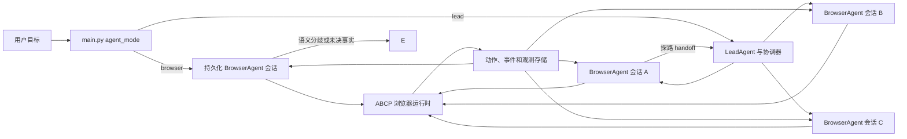

# 持久化 BrowserAgent 运行时重构方案

## 状态

已确认的设计方案。本文只定义目标架构、迁移边界和验收标准，不代表实现已经开始。

## 背景与目标

Harness 当前的主要性能问题不是单个浏览器 RPC 慢，而是模型和控制面被过度拆分：

- Lead 的计划生成、计划修复、审查和批准路径会在浏览器工作开始前消耗大量模型回合。
- BrowserAgent 将多数页面变更当作模型回合边界，形成“操作一次 → 重新观察 → 再请求模型”的循环。
- 截图落盘后交给独立 VL 模型，再将文字结论转回 BrowserAgent；主 BrowserAgent 不能直接看图。
- 固定 `max_steps` 会结束仍可继续工作的 worker，触发续 step、交接、重建上下文和重派。
- Python ABCP 客户端只允许一个 in-flight RPC，并兼容未严格回显请求 ID 的旧响应形状。

重构目标是让 BrowserAgent 能在一个持久化执行会话里完成一段已确定的浏览器程序；只在出现新的语义选择、页面事实不充分、权限边界或用户输入时回到模型。对可并行的批量任务，多个 BrowserAgent 仍可并发工作。

本方案不以“多执行几步”为目标。它要求每一个可恢复、可归因的副作用仍有动作记录、结果核验和权限边界。

## 已确认的设计决定

1. **入口模式显式选择。** `main.py` 提供 `agent_mode=lead|browser`。`browser` 直接运行一个 BrowserAgent，不创建 LeadAgent、完整 phase plan 或计划审查模型；`lead` 运行协调、计划、多 Agent 并发、依赖和汇总路径。本阶段不定义或实现 `auto` 模式。
2. **取消固定 browser step 终止。** 模型回合继续记录为遥测数据，但不再因固定轮次耗尽而结束任务、续 step 或更换 worker。全局时间、费用、并发和单次动作超时仍是显式资源边界；到达边界时暂停并保留会话和检查点。
3. **保留并增强多 Agent 并发。** 已批准计划中可并行的同阶段实体由调度器直接派发。每个 worker 拥有自己的持久化执行会话；共享页面、输入焦点、登录态或 fleet 生命周期等真实共享资源仍按资源加锁。
4. **保留首个详情页探路与 sibling handoff。** 首个详情页的工作计入最终交付。其成功路线、字段位置、失败尝试和成本可供后续同类 worker 复用；不能跨页面复用 AX ID、坐标、页面值或把经验当作新页面事实。
5. **BrowserAgent 直接接收截图。** BrowserAgent 基模为多模态模型。删除独立 VL 推理链路；保留并迁移不含模型调用的截图采集、裁剪、坐标换算、范围和时间绑定能力。
6. **删除旧响应兼容。** 请求与响应必须严格使用唯一 `requestId` 关联。未知、缺失或过期 ID 的响应不得匹配任何请求；不再用“响应形状像结果”作为回退。
7. **不把业务语义固化为机械门。** 机械层只检查协议、权限、身份绑定、资源所有权、动作结果的结构完整性、算术/不变量和明确条件的字面一致性。选择业务路径、字段是否语义匹配、是否继续尝试、何时采用树或视觉，由模型基于原始目标和证据判断。

## 目标架构



### 入口与协调

`main.py` 在运行时显式选择两条互斥入口，终端、配置文件或 API 调用方都可传入该选择：

- `agent_mode=browser`：直接创建一个持久化 BrowserAgent 会话。它不创建 LeadAgent，不生成完整 phase plan，也不隐式升级为协调模式。适用于调用方明确选择的单 Agent 执行。
- `agent_mode=lead`：创建 LeadAgent 与协调器。它适用于调用方明确需要计划、多 Agent 并发、生产者/消费者依赖、跨 worker 汇总或审批控制的任务。

本阶段不提供 `auto`。运行时不额外调用模型判断入口，也不根据任务文本偷偷切换模式。用户显式要求先给计划或先审批时，调用方应选择 `lead`；`browser` 模式不承担这类协调职责。

协调器是任务状态和资源调度组件，不是每一步都参与的第二个思考模型。它负责依赖、实体分配、并发额度、资源锁、结果汇总和 handoff 投递。

### 持久化执行会话

每个 BrowserAgent 会话保持：

- 任务目标、已批准约束、可用资源和未完成的语义问题；
- 浏览器页面/fleet 绑定、程序变量、操作记录和结果引用；
- 当前页面的局部结构事实、截图引用和对其版本/范围的描述；
- 可恢复检查点，而不是无限增长的完整对话转录。

模型一次可以向会话提交一段受控程序。程序能够依次执行读取、填写、点击、等待、批量采集和明确的条件检查。程序不能获得任意主机权限，也不能通过任意页面脚本绕开 ABCP Action 的权限、输入和审计边界。

```javascript
await form.field("keyword").fill(query);
await form.field("region").select(region);

const values = await form.readValues();
if (!sameRequestedValues(values, { query, region })) {
  return yieldToAgent({ reason: "field_values_differ", values });
}

const ready = page.expect(resultsRegion.readyCondition);
await form.searchButton.click();
await ready;
return resultsRegion.readRows();
```

`sameRequestedValues` 只能比较模型明确指定的值与浏览器实际读回值；它不能推断业务字段含义。`readyCondition` 必须来自当前页面观察与模型选择，不能由运行时猜测某网站的成功标准。

### 预算与生命周期

删除 `max_steps`、`effective_max_steps`、`request_step_extension` 和 step 耗尽后的续派逻辑。模型回合、动作数、观测量、等待时长仍写入遥测，用于发现性能退化。

资源边界改为：

- 单次动作/程序的可取消超时；
- 用户或运行配置明确给出的总时长、费用和并发上限；
- 上下文容量阈值下的同会话压缩和证据外置。

超时、断连或用户暂停后，恢复同一逻辑会话。对于结果未知的状态改变动作，先按动作记录和当前页面事实核验，不能盲目重放。

## 感知与动作一致性

### 证据选择

每次继续前选择回答“下一问题”所需的最小证据，避免默认读取全 AXTree 和全页截图：

| 问题 | 优先证据 |
| --- | --- |
| 控件名称、可访问状态、表单值、链接 | AXTree 局部投影或直接 DOM 读取 |
| DOM 关系、属性、Shadow DOM | 局部 SemanticTree |
| 遮挡、图标、canvas、视觉顺序、布局 | 截图直接输入 BrowserAgent |
| 批量文本和属性 | `DOM.getText` / `DOM.getAttribute` 批量读取 |
| 结构与画面相互矛盾 | 同区域树、截图和动作回执一起交给 Agent |

截图必须附带页面/Frame、视口、缩放、滚动位置、截图范围和采集时间。截图可以证明画面内有什么，不能独自证明整页不存在字段或后台业务已经成功。

### 目标绑定不能只看 ID 与 role

相同节点 ID、role 或 selector 并不保证页面没有变化，更不保证它仍代表同一个业务对象。虚拟列表可能复用同一个节点展示另一个商品；反过来，同一商品也可能被新的节点替换。

执行段中的目标验证分三层：

1. **物理可操作性**：页面/frame 可用、目标解析唯一、可见/可命中或返回准确的不可操作原因。
2. **当前内容事实**：读取模型要求保持的文本、href、输入值、所属区域等事实。
3. **业务身份**：由 Agent 判断上述事实是否仍是用户要操作的商品、字段或路径。

浏览器层已有目标解析、stale-id recovery、局部 DOM 读取、`snapshotGeneration`、遮挡和 hit-test 失败回执等能力，但尚无统一的“将前置条件检查与紧随其后的动作原子绑定”的通用协议。该协议是浏览器侧新增项。

拟议的绑定 Action 至少要：

- 在同一 page/frame 上解析目标并读取声明的前置事实；
- 只在所有前置条件满足时派发动作；
- 返回实际解析来源、检查事实、动作回执、页面版本和可能的竞争迹象；
- 条件不满足时不派发，返回新旧事实给 Agent；
- 不宣称检查后 DOM 或业务语义绝不会变化。

## 并发、探路和经验传播

同一页面的导航、滚动、输入焦点和 modal 是串行资源；独立详情页、下载、文件处理和不同 fleet 可并发，前提是运行时资源调度允许。

对同类详情任务：

1. 首个 worker 处理一个真实实体并将结果计入交付。
2. 它发布结构化 handoff：适用页面类型、成功路径、观察到的字段位置、失败路径、成本、证据引用及适用条件。
3. 协调器在 handoff 被验证后，将其投递给尚未开始的同类 worker；已经运行的 worker 可在安全边界读取最新 handoff。
4. 接收 worker 用自身页面事实验证 handoff 是否适用。它不能把 handoff 中的临时 ID、坐标或页面值当作当前事实。

现有 `_sibling_phase_handoff` 和首页面调度检查点的语义应保留。迁移时要把“后续派发时读取已有 handoff”升级为会话可订阅的结构化经验流；它仍然只是建议和证据索引，不是权限或事实来源。

## 异步协议和运行时接口

将现在拟议的主动观测接口命名为 `inspect`，避免与 WebCross ActionFeedback 的 `observation` 混淆：

| 名称 | 含义 |
| --- | --- |
| ActionFeedback `observation` | 某个 Action 返回的文字摘要；不是自动更新的页面状态 |
| `inspect` | 主动采集指定页面或区域的当前结构、文本、状态或截图，并报告采集范围和时间 |
| `exec` | 提交一段受控浏览器程序；快速完成时直接返回，否则返回 operation handle |
| `wait` | 等待指定 operation 或事件游标推进 |
| `cancel` | 请求停止，返回已发生动作和未决状态 |

Dispatcher 与 Python 客户端升级为严格 request ID 协议：

- 客户端维护 `pending[requestId]`，允许多个独立请求在途；
- 所有响应必须回显原 request ID；事件必须使用 notification 信封，不能伪装响应；
- 未知、已超时或重复 ID 的响应进入诊断通道，不能唤醒其他请求；
- operation handle 与动作记录绑定，断线重连后可使用游标读取状态；
- 同页有因果依赖的写操作保持顺序，独立资源可重叠执行。

这不是把浏览器任务交给模型提供方后台执行。异步工具只允许模型在独立工作仍在运行时继续做其他工作；任务、结果、取消和恢复仍由 Harness/ABCP 负责。

## 独立语义复核

独立裁判不进入每个普通点击的主路径。它有三个明确入口：

- 已批准计划要求的阶段或批次交付复核；
- Agent 提交了有具体证据的语义争议；
- 协调器准备改变既有交付承诺，需要核对原始目标和证据。

现有字段语义审查的核心目的应保留：结构正确、来源齐全的值仍可能回答了错误的业务对象。审查输入必须包含原始目标、待交付结果、原始证据及明确问题；输出是“支持、矛盾、证据不足”与证据引用。机械层仅检查覆盖、结构和引用完整性，不替裁判判断业务语义。

## 删除、迁移与保留清单

### 删除

- `browser_agent_step_extension_enabled` 配置和验证；
- `request_step_extension` 工具、提示词、事件和处理器；
- `base_max_steps` / `effective_max_steps` 的正常终止与续派路径；
- 独立 VL provider、VL 模型调用、VL 专用重试和 BrowserAgent 看不到截图的适配层；
- Python 客户端按响应形状匹配当前请求的旧兼容分支；
- 强制所有可执行任务必须先走 LeadAgent/完整 phase plan 的入口限制。

### 迁移

- 把截图采集、几何、裁剪、坐标映射和截图证据绑定从 `harness.vl` 移到通用观测模块；
- 将 BrowserAgent 消息适配器升级为多模态输入，图片与上下文一同送入当前 Agent；
- 将 phase/worker 状态持久化为可恢复会话检查点和 operation ledger；
- 将现有任务/事件流升级为严格 request ID 与 cursor 协议；
- 将 direct route 改为真正的 BrowserAgent 入口，而非 Lead 下的单 phase 包装。

### 保留

- ABCP Action 的权限、身份、fleet/page 绑定和资源调度边界；
- 动作回执、事件流、持久化动作记录和不确定副作用的先核验后恢复原则；
- 多 Agent 同阶段并发、实体分片、producer/consumer artifact 依赖；
- 首个详情页探路、sibling handoff、失败经验共享和跨页临时目标不可复用原则；
- 当前结构化树、DOM 批量读取、目标恢复和页面生命周期能力；
- 独立字段语义复核的语义，但移除其不必要的逐步阻塞使用方式。

## 实施阶段

### 阶段 A：测量与入口解耦

建立任务级时间线，分别记录模型等待、浏览器执行、队列等待、人工等待、审查和重试。实现 `main.py` 的 `agent_mode=lead|browser` 分支：`browser` 直达 BrowserAgent，`lead` 保持现有协调入口。暂时沿用现有单次浏览器 Action 工具。

验收：`browser` 模式不创建 LeadAgent；`lead` 模式保持现有协调计划可运行；完整日志可以拆分各类等待；不存在 `auto` 参数、隐式升级或任务文本分类分支。

### 阶段 B：持久会话与取消 step 终止

引入会话检查点和运行 ledger，删除 step extension 和固定模型回合终止路径。实现上下文压缩而不更换逻辑 Agent。

验收：长任务不会因固定 step 数结束；暂停、恢复和不确定副作用核验可复现；重启后可读取会话和 operation 状态。

### 阶段 C：多模态直接视觉与执行程序

让 BrowserAgent 直接接收图片，迁移非推理视觉工具。实现受控程序 `exec`、局部 `inspect` 和仅在明确分歧处 `yieldToAgent` 的闭环。

验收：已知的多字段填写/查询流程可以在一次模型派发中完成多步；视觉判断无需单独 VL 模型回合；截图元数据可以复核坐标与范围。

### 阶段 D：严格异步协议和绑定 Action

移除旧响应兼容，启用多在途请求、operation handle、事件 cursor、`wait`/`cancel`。新增“检查前置条件并派发动作”的通用浏览器 Action。

验收：乱序响应、事件先到、重复事件、超时迟到响应和断线重连均不会串错请求；绑定条件失败时确认浏览器未派发动作。

### 阶段 E：并发经验流与对照评估

将 sibling handoff 升级为可订阅经验流，验证一页探路后多详情 Agent 并发的效果。对照相同目标、相同模型和相同初始页面状态，比较直达、单 worker 和并发路径。

验收指标：

- 首个有效浏览器动作耗时；
- 任务 p50/p95 总耗时，且人工等待单列；
- 每个交付实体的模型回合和浏览器动作数；
- 同类详情页探路后的重复探索比例；
- 成功率、错误恢复率和动作归因正确性；
- 语义复核发现的有效问题率。

## 风险与恢复路径

| 风险 | 防护与恢复 |
| --- | --- |
| 程序连续执行错误路径 | 每段只执行 Agent 明确选择的动作；发现分歧即 yield；保留逐动作 ledger |
| 异步响应串台 | 严格 request ID；未知/过期响应隔离到诊断；不保留形状匹配回退 |
| 页面虚拟化导致目标换义 | 读取模型声明的当前事实；业务身份由 Agent 判断；不把相同 ID/role 当作同一对象 |
| 视觉判断越过截图范围 | 截图携带范围/时间/几何；局部画面不能推出全页或后台结论 |
| 探路经验误用于不同页面 | handoff 标注适用条件和证据；接收 worker 必须以本页事实校验 |
| 持久会话无限资源消耗 | 显式总资源预算、单次超时、取消和检查点；不以固定模型 step 终止替代 |

## 当前代码迁移定位

以下位置是后续实现的主要切入点，列出它们是为了让迁移范围可审查，不表示可直接删除：

- `agent_harness.py`：BrowserAgent/LeadAgent 主循环、`max_steps`、`request_step_extension`、入口路由与提示词；
- `runtime_config.py`：step extension 和运行时预算配置；
- `harness/tools/browser_tools/dispatch.py`：BrowserAgent 工具声明和 step extension handler；
- `harness/vl/` 与 `harness/tools/browser_tools/visual.py`：从独立视觉推理迁移到多模态 BrowserAgent；
- `abcp_client.py`：单 pending call 与旧响应形状兼容逻辑；
- `abcp-platform/packages/dispatcher/`：request ID、并发执行队列、operation 和事件 cursor；
- `harness/tools/lead_tools.py`：保留并迁移 sibling handoff；
- `harness/task_control/` 与 `harness/spawner/`：协调任务的依赖、资源和恢复逻辑。
